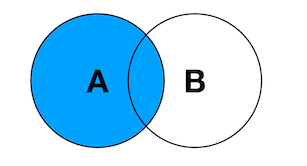

[toc]


# MariaDB

## 1 数据库

### 1.1 概述

- 数据存储

  - 文件管理阶段
    * 优点 ：  数据可以长期保存,可以存储大量的数据,使用简单。
    * 缺点 ：  数据一致性差,数据查找修改不方便,数据冗余度可能比较大。

  * 数据库管理阶段
    * 优点 ： 数据组织结构化降低了冗余度,提高了增删改查的效率,容易扩展,方便程序调用处理
    * 缺点 ： 需要使用sql 或者其他特定的语句，相对比较专业


- 数据库应用领域

  数据库的应用领域几乎涉及到了需要数据管理的方方面面，金融机构、游戏网站、购物网站、论坛网站 ... ...都需要数据库进行数据存储管理。 

### 1.2 基本概念

- 数据库 **Database**

  按照数据特定的结构，存储管理数据的仓库。

- 数据库管理系统 **DBMS** 

  一套独立可运行的管理数据库的软件，用于维护磁盘上的数据；维护性好，性能好，可扩展性强。

  

* 关系型数据库和非关系型数据库

  * 关系型数据库

    采用关系模型（行列构成的二维表）来组织操作呈现数据的数据库，也称为SQL数据库。

    比如： MySQL、MariaDB、Oracle、SQL Server 等。

  * 非关系型数据库

    没有固定的表结构和关系模型，数据通常以键值对的形式存储，也被称为NoSQL数据库。

    比如：MongoDB、Redis等。

### 1.3 关于MariaDB

MariaDB是关系型数据库，由MySQL的原创开发者在MySQL被甲骨文公司收购后创建的。

MariaDB的目标是成为MySQL的替代品，因此它与MySQL具有很高的兼容性。

* 特点

  * 开源

  * 跨平台（Windows、Linux、Mac）

  * 提供众多语言的API：C、C++、Python、Java、Perl、PHP、Ruby等

  * 运行速度快

* 安装

  详见 `MariaDB安装文档`

### 1.4 数据库管理系统常见概念

<font color=red>**DBMS - 库 - 表 - 表记录**</font>

**1）关系说明**

在DBMS数据库管理系统中，可以根据不同的项目创建多个库，在每个库中可以根据项目需求创建不同的数据表，数据表中存放的是具体的数据。


**2）库 database**

是表的集合，一个库中可以存放若干张表，通常库服务于项目。


**3）表 table**

是数据的集合，具有一组相同属性的数据存放在同一张表中。

行（row）：称为是 **记录**，表中每一条数据

列（column）：称为是 **字段**，每一条记录的属性


### 1.5 SQL语言

#### 1）数据库角色

数据库是一个独立运行的软件，并且是以 **服务端** 的形式体现的，我们要操作数据库则需要以客户端的角度与服务端建立连接并进行相关的操作。

#### 2）SQL语言

我们连接上数据库后，向其发送 **SQL** 语句，数据库理解该SQL语句的含义并执行相关操作并回馈结果。

* 什么是SQL语言

  结构化查询语言(Structured Query Language)，是一种数据库查询和程序设计语言，用于存取数据以及查询、更新和管理关系数据库。

* SQL语言特点

  - SQL语言基本上独立于数据库本身
  - 各种不同的数据库对SQL语言的支持与标准存在着细微的不同
  - 每条命令最好以 ; 结尾
  - SQL语句不区分大小写，但是好的书写习惯：关键字大写，非关键字小写

#### 3）SQL分类

- **DDL**：数据定义语言，是操作数据库对象的语言。数据库对象（库，表，视图，索引，序列）

- **DML**：数据操作语言，是操作表中数据的语言。对表中数据操作的语言(增INSERT，删DELETE，改UPDATE)
- **DQL**：数据查询语言，是查询表中数据的语言。SELECT语句(学习的重点和难点)
- **DCL**：数据控制语言，管理数据库的语言(权限分配等，DBA关心的)
- **TCL**：事务控制语言，事务控制语言。


### 1.6 数据库的连接方式

#### 1）常用的客户端

- 命令行
- 图形化界面
- JDBC
- 集成开发环境(IDE)


#### 2）IDEA连接MariaDB数据库

第1步：点击idea窗口右侧 Database，在 Data Source 中选择 MySQL


第2步：填写连接名称Name 或 描述Comment，输入用户名和密码都为root，首次连接需要下载驱动，点击 Download


第3步：输入SQL语句，选中后，可以点击左上方 <font color=green>**绿色箭头**</font> 执行SQL语句


## 2 DDL数据定义语言

对数据库对象进行操作的语言，涉及到的关键字CREATE、ALTER、DROP等

### 2.1 数据库管理

#### 1）DDL指令

1. 查看已有库

   ```mysql
   SHOW DATABASES;
   ```

2. 创建库

   ```mysql
   CREATE DATABASE 数据库名 [CHARSET=字符集];
   
   eg1. 创建数据库mydb
   CREATE DATABASE mydb;
   
   eg2. 创建数据库mydb1，指定字符集为UTF8
   CREATE DATABASE mydb1 CHARSET=UTF8;
   
   eg3. 创建数据库mydb2，指定字符集为GBK
   CREATE DATABASE mydb2 CHARSET=GBK;
   ```

   > 注意：数据库中标识符命名规则
   >
   > 1. 数字、字母、下划线，但不要使用数字开头
   > 2. 尽量不要使用特殊字符和mysql关键字
   > 3. 多个单词使用下划线连接，尽量见名知意

3. 查看创建数据库时的信息

   ```mysql
   SHOW CREATE DATABASE 数据库名;
   
   eg. SHOW CREATE DATABASE mydb;
   ```

4. 切换库

   ```mysql
   USE 库名;
   
   eg. 切换到数据库mydb
   USE mydb;
   ```

5. 删除库

   ```mysql
   DROP DATABASE 库名;
   
   eg. 删除mydb库
   DROP DATABASE mydb;
   ```

#### 2）课堂练习

1. 创建 db1和db2 数据库 字符集分别为utf8和gbk
2. 查询所有数据库检查是否创建成功
3. 检查两个数据库的字符集是否正确(查看创建时的SQL)
4. 先使用db2 再使用 db1
5. 删除这两个数据库


### 2.2 数据表管理

#### 1）DDL指令

1. 创建表

   ```mysql
   CREATE TABLE 表名(
   	字段名1 类型[(长度)] [DEFALUT 默认值] [约束],
       字段名2 类型,
       ...
   )[CHARSET=字符集]
   ```

   eg.

   ```mysql
   # 1.创建库mydb，并切换到该库
   CREATE DATABASE mydb;			# 创建数据库mydb
   USE mydb;						# 切换到mydb，后面创建表都是创建到这个库中
   
   # 2.创建一张表user，保存用户信息(用户名，密码，昵称，年龄)
   CREATE TABLE user(
   	id INT,					# 整型
       username VARCHAR(32),   # 字符类型，长度为最大字符数，即不能超过32个字符
       password VARCHAR(32),   # 字符类型，字符长度最大不能超过32个
       nickname VARCHAR(32),
       age INT                 # 整型
   )
   ```


2. 查看当前库中所有数据表

   ```mysql
   SHOW TABLES;
   ```

   

3. 查看表结构

   ```mysql
   DESC 表名;
   
   eg. 查看user表的表结构
   DESC user;
   ```


4. 查看数据表创建信息

   ```mysql
   SHOW CREATE TABLE 表名;
   
   eg. 查看user表的创建信息[字符编码]
   SHOW CREATE TABLE user;
   ```


5. 修改表名

   ```mysql
   RENAME TABLE 原表名 TO 新表名;
   
   eg. 将user表重命名为 userinfo 表
   RENAME TABLE user TO userinfo
   ```

   

6. 删除表

   ```mysql
   DROP TABLE 表名;
   
   eg. 删除user表
   DROP TABLE user;
   ```


#### 2）课堂练习

1. 创建数据库mydb3 字符集utf8 并使用
2. 创建t_hero英雄表, 有名字和年龄字段
3. 修改表名为hero
4. 查看表hero的信息
5. 查询表hero结构
6. 删除表hero
7. 删除数据库mydb3


#### 3）修改表结构ALTER

准备一张表hero

```sql
CREATE TABLE hero(
	name VARCHAR(32),
	age INT(3)
);
```


1. 添加字段 - ADD

   * 表末尾追加字段

     `ALTER TABLE 表名 ADD 字段名 类型[(长度) 默认值 约束]; `

   * 表起始追加字段

     `ALTER TABLE 表名 ADD 字段名 类型 FIRST;`

   * 指定位置追加字段

     `ALTER TABLE 表名 ADD 字段名 类型 AFTER 表中现有字段名;`

   * 示例

     ```mysql
     1. 向表hero的末尾添加一个新字段gender，它的类型是字符串，最大宽度为10
        ALTER TABLE hero ADD gender VARCHAR(10);
        
     2. 在hero表最开始添加id字段，类型为int
        ALTER TABLE hero ADD id INT FIRST;
        
     3. 在name字段后面添加密码pwd字段
        ALTER TABLE hero ADD pwd VARCHAR(32) AFTER name;
     ```

     

2. 删除字段 - DROP

   ```mysql
   ALTER TABLE 表名 DROP 字段名;
   
   eg.将hero表中的pwd字段删除
   ALTER TABLE hero DROP pwd;
   ```

   

3. 修改字段数据类型 - MODIFY

   ```mysql
   ALTER TABLE 表名 MODIFY 字段名 新数据类型;
   
   eg.修改hero表中的name字段长度为64
   ALTER TABLE hero MODIFY name VARCHAR(64);
   ```

   

4. 替换字段 - CHANGE

   ```mysql
   ALTER TABLE 表名 CHANGE 旧字段名 新字段名 新数据类型;
   
   eg.修改hero表中的gender字段，改名为nickname 类型为字符串，最大宽度为32
   ALTER TABLE hero CHANGE gender nickname VARCHAR(32);
   ```

   

* 修改表结构的注意事项

  - 修改表结构最好是在表中没有数据的情况下进行

  - 当表中含有数据时
    - 尽量不修改表中某字段的类型，否则可能因为现有数据不满足新修改的类型导致修改失败
    
    - 尽量不缩短字段长度
    
    - 若为字段新添加约束，该字段现有的数据不能违反该约束
    
      

#### 4）综合练习

1. 创建数据库mydb4 字符集utf8并使用
2. 创建teacher表 有名字(name)字段
3. 添加表字段: 最后添加age 最前面添加id(int型) , age前面添加salary工资(int型)
4. 删除age字段
5. 修改表名为t
6. 删除表t
7. 删除数据库mydb4


## 3 DML表记录管理

**DML是对表中数据** 进行操作的语言，涉及的关键字：**INSERT UPDATE DELETE**

- INSERT

  向表中插入新数据的语句

- UPDATE

  修改表中数据的语句

- DELETE

  删除表中数据的语句
  
  

**准备工作**

```sql
USE mydb;					# 使用mydb库
CREATE TABLE person(		# 创建表person
	name VARCHAR(30),
    age INT
)
```


### 3.1 插入数据INSERT

<font color=red>**向数据表中插入数据**</font>

#### 1）语法

* **全列插入**

  在INSERT语句中不指定字段时，为全列插入，此时要求VALUES子句后面 **指定的值的个数，顺序，类型必须与表结构中字段完全一致**

  ```mysql
  INSERT INTO 表名 VALUES(值1,值2,...)	# 要求VALUES子句中指定的值必须与表结构一致
  
  eg. 在person表中插入1条数据
  INSERT INTO person VALUES('张三',12);
  
  补充：查询表中数据
  SELECT * FROM person;
  ```

  

* **选择字段插入**

  ```mysql
  INSERT INTO 表名 (字段1,字段2,字段3,...) VALUES (值1,值2,值3,...);
  向表中插入一条记录，将值1插入的到字段1中，将值2插入到字段2中
  
  eg.
  INSERT INTO person (name,age) VALUES ('李四',22);
  INSERT INTO person (age,name) VALUES (33,'王五');
  INSERT INTO person (name) VALUES ("赵六");
  ```

  > 注意
  >
  > 1. 在数据库中，**字符串的字面量** 是使用 **单引号括起来**的，需要注意
  >
  > 2. 在INSERT语句中 **指定的字段** 与VALUES后面 **指定的值** 的 **顺序、个数、类型要完全一致**
  >
  > 3. 在INSERT语句中字段指定时的顺序和个数可以与表结构定义时不一致

  

* **批量插入**

  一次在数据表中插入多条记录

  ```mysql
  INSERT INTO 表名(字段...) VALUES(第一组值...),(第二组值...),....;
  
  eg.一次插入三条记录
  INSERT INTO person(name,age) VALUES('阿猫',11),('阿狗',22),('阿三',33);
  ```

  

#### 2）关于默认值

INSERT语句中指定字段时，忽略的字段会被插入默认值。**当表中字段没有被明确指定默认值时，默认值一律为NULL**

使用 `DEFAULT` 关键字来为字段指定默认值，可以在创建表时，也可以在修改表时指定

* 创建表时指定默认值

  ```mysql
  CREATE TABLE person(
  	name VARCHAR(30) DEFAULT '无名氏',
  	age INT(3) DEFAULT 30
  )
  ```

* 修改表时为字段指定默认值

  ```mysql
  ALTER TABLE person MODIFY name VARCHAR(30) DEFAULT '无名氏';
  ```

* 测试

  此时向person表中插入数据时，若不指定name字段，该字段默认值插入'无名氏'

  ```mysql
  INSERT INTO person (age) VALUES (55);
  ```

* 练习 

  1. 创建库 shopdb，并切换库；

  2. 创建用户表 user，字段要求如下：

     用户编号id，int

     用户名username，CHAR(20)

     密码 password，CHAR(32)

     手机号phone，CHAR(11)   默认值 13911112222

     邮箱email , CHAR(50)

  3. 查看表结构

  4. 在user表中 全列插入1条数据，并查询确认 SELECT * FROM user；

  5. 在user表中，指定id、用户名、密码 三个字段，插入2条数据，并查询确认。

  6. 切换回mydb库

  

### 3.2 更新数据UPDATE

<font color=red>**修改表数据**</font>

#### 1）语法

```sql
UPDATE 表名
SET 字段1=新值,字段2=新值,...
[WHERE 过滤条件];
```

**示例**

```sql
UPDATE person
SET age=40;
此时该SQL执行后，person表中每条记录的age字段都会被改为40
```

**注:当UPDATE语句中不添加WHERE子句时，会将表中所有记录进行修改，这种操作实际开发中很少见**


#### 2）WHERE子句

当UPDATE语句添加了WHERE子句时，只有满足WHERE子句要求的记录才会被修改

**示例1：将张三的年龄修改为22**

```sql
UPDATE person
SET age=22
WHERE name='张三';

数据库在修改记录时对表是逐行进行的，每一行是否进行修改取决于该行记录是否满足WHERE子句的条件要求
```


**示例2：将40岁的人改为36岁**

```sql
UPDATE person
SET age=36
WHERE age=40;
```


**示例3：将李四的名字改为'李老四'，年龄改为66**

```mysql
UPDATE person
SET name='李老四',age=66
WHERE name='李四';
```


#### 3）WHERE子句基础条件

WHERE子句会在后面DQL中详细展开介绍

WHERE中基础条件：**>, >=, <, <=, =, !=**

**示例1：将年龄高于30岁的人改为29**

```sql
UPDATE person
SET age=29
WHERE age>30;
```


#### 3）使用表达式修改

将每个人的年龄涨一岁

```sql
UPDATE person
SET age=age+1;
```


### 3.3 删除数据DELETE

<font color=red>**删除表中数据**</font>

#### 1）语法

```sql
DELETE FROM 表名
[WHERE 过滤条件];
```

**注:DELETE语句通常不会忽略WHERE子句，否则是清空表操作!**

**示例**

```sql
删除person表中'李老四'
DELETE FROM person
WHERE name='李老四';			# 仅删除person表中name字段为'李老四'的记录

删除年龄小于25岁的人
DELETE FROM person
WHERE age<25;
```


#### 2）清空表

```sql
DELETE FROM person
```


#### 3）DML总结

- INSERT语句，向表中插入数据的语言
  - INSERT语句指定的字段顺序，个数可以与表结构不一致，但是VALUES子句后指定的值必须与指定的字段顺序，类型，个数完全一致
  - INSERT语句在指定字段时，可以忽略某些字段，此时插入数据时被忽略的字段会插入默认值
  - INSERT语句中可以使用关键字 **NULL** 显示声明插入NULL值
  - INSERT语句中不指定字段时为全列插入，此时VALUES后指定的值的顺序，个数，类型要与表结构完全一致。实际开发中不推荐这样的写法。
- UPDATE语句，修改表中记录的语言
  - UPDATE语句通常要指定WHERE子句，如果不指定则为全表修改
- DELETE语句，删除表中记录的语言
  - DELETE语句通常要指定WHERE子句，**否则是清空表操作**


#### 4）综合练习

1. 创建数据库day2db 字符集utf8并使用

2. 创建t_hero表, 有name字段,字符集utf8

3. 修改表名为hero

4. 最后面添加价格字段money(整数类型), 最前面添加id字段(整数类型), name后面添加  age字段(整数类型)

5. 表中添加以下数据: 

   1,李白,50,6888    

   2,赵云,30,13888    

   3,刘备,25,6888

6. 修改刘备年龄为52岁

7. 修改年龄小于等于50岁的价格为5000

8. 删除价格为5000的信息

9. 删除表, 删除数据库


## 4 数据类型

设计一张表时，要为表中每一个字段指定类型以确保该字段可以保存正确类型的数据

### 4.1 数值类型

#### 1）整数类型

* INT类型

  占用4个字节，保存范围+-21亿

* BIGINT类型

  占用8个字节

#### 2）浮点数类型

* DOUBLE(M,N)  

  - M是一个数字，表示数字的总位数

  - N是一个数字，表示小数位的位数

  - DOUBLE(7,2)  可以保存一个7位数，其中2为是小数，整数5位


* 示例

  ```mysql
  CREATE TABLE person1(
  	age INT,					
      salary DOUBLE(7,2)			# 最大99999.99
  );
  ```

- 插入小数

  ```sql
  INSERT INTO person1(salary) VALUES(99999.99);
  ```

- 如果小数位的精度超过了允许精度时，会进行四舍五入

  ```sql
  INSERT INTO person1(salary) VALUES(1234.867);
                                            ^7会进行四舍五入
  实际插入表中后，该记录salary字段的值位1234.87                                          
  ```

- 如果四舍五入后得到的值超过了该字段可以保存的最大值时会报错

  ```sql
  INSERT INTO person1(salary) VALUES(99999.997);
  ```

  

  

### 4.2 字符类型

#### 1）定长字符串

**CHAR类型是定长字符串**

- CHAR(m):m是一个数字，表示长度，**单位是字符**。m最大可取255

- CHAR类型在磁盘中开辟的长度是固定的。

- 优点：在磁盘中保存每条记录的长度是固定的，因此读取速度快

- 缺点：在磁盘中占用空间固定，无论实际保存数据多少，都要占够空间，因此对磁盘空间有浪费


#### 2）变长字符串

**VARCHAR类型**

- VARCHAR(m)：m是一个数字，表示字符串的长度
- 实际占用磁盘空间按照实际保存的数据而定
- 优点：由于磁盘空间占用取决于实际保存的数据，因此不造成磁盘空间浪费
- 缺点：由于数据长度不一致，会导致读取效率低

##### TEXT类型

- TEXT(m):m是一个数字，m最大值为65535


### 4.3 日期类型

- **DATE** 用于保存年月日 `"1987-10-16"`

- **TIME** 用于保存时分秒 `10:10:10`

- **DATETIME** 用于保存年月日时分秒 `1987-10-16 10:10:10`

- **TIMESTAMP** (时间戳)，保存UTC时间，记录自1970年元旦至表示的时间所经过的毫秒 

  `1987-10-16 10:10:10`


**示例**

```sql
CREATE TABLE userinfo(
	id INT,						# id整数类型
    name VARCHAR(30),			# name字符串类型，最大宽度为30
    gender CHAR(1),				# gender字符串类型，最多1个字符
    birth DATETIME,				# birth日期类型，保存年月日时分秒
    salary DOUBLE(7,2)			# salary浮点数类型，最多保存99999.99
);
```

- 插入一个日期类型的数据时，DATETIME类型为例(可以保存年月日时分秒)，可以使用字符串来表示，但是格式必须为"yyyy-MM-dd hh:mm:ss"(M表示月，m表示分)

  ```sql
  INSERT INTO userinfo(id,name,gender,birth,salary)
  VALUES(1,'张三','男','1998-08-03 10:22:35',5000.65);
  ```

  

## 5 约束条件

我们可以为表添加约束条件，可以限制对表的操作必须符合我们施加的约束条件，否则数据库会拒绝该操作

### 5.1 主键约束PrimaryKey

#### 1）主键约束

- 主键约束要求该字段的值必须 **非空且唯一**

- 主键约束一般会为表中第一个字段添加，并且通常该字段取名为"id"

- 示例

  ```mysql
  CREATE TABLE user1(
  	id INT PRIMARY KEY,		# 为id字段添加主键约束
  	name VARCHAR(30),
  	age INT
  );
  
  INSERT INTO user1 (id,name,age) VALUES(1,'张三',22),(2,'李四',33);
  ```

  

  <font color=red>主键字段不能插入重复的值，并且在修改表记录时，也不可以将重复的值修改到主键字段。</font>


#### 2）自增长

具有主键约束的字段通常主键的生成方式由系统完成，而自增就是其中一种方式

**示例**

- 创建表时为主键字段添加自增

  ```sql
  CREATE TABLE user2(
  	id INT PRIMARY KEY AUTO_INCREMENT,
      name VARCHAR(30),
      age INT(3)
  )
  ```

  

  

- 当主键字段具有自增时，插入数据则可以忽略主键字段

  ```sql
  INSERT INTO user2(name,age) VALUES('张三',33);
  INSERT INTO user2(name,age) VALUES('李四',26)
  ```

  

- 当主键字段具有自增时，可以显示的向主键中插入NULL值，但此时主键字段仍然使用自增

  ```sql
  INSERT INTO user2(id,name,age) VALUES(NULL,'王五',45);
  ```

  

### 5.2 非空约束(NOT NULL)

被非空约束施加的字段，该字段的值不能为NULL

**示例**

- 创建表时为字段添加非空约束

  ```sql
  CREATE TABLE user3(
  	id INT PRIMARY KEY AUTO_INCREMENT,
      name VARCHAR(30) NOT NULL,				# name字段施加非空约束
      age INT
  )
  ```

  

  

- 插入数据时，不能向具有非空约束的字段中插入NULL值

  ```sql
  INSERT INTO user3(name,age) VALUES(NULL,22);	# 不可以将NULL值插入name字段
  ```

  

### 5.3 唯一性约束(UNIQUE)

具有唯一性约束的字段值不允许重复，但是可以为NULL。

**示例**

- 创建表时为字段添加唯一性约束

  ```mysql
  CREATE TABLE user4(
  	id INT PRIMARY KEY AUTO_INCREMENT,
  	name VARCHAR(30) UNIQUE,
      age INT
  )
  ```

  

  

- 插入数据时，不可以将重复的值插入到具有唯一性约束的字段中

  ```sql
  INSERT INTO user4(name,age) VALUES('张三',22);	# 可以
  INSERT INTO user4(name,age) VALUES('张三',45);	# 不可以再次插入'张三'到name字段
  ```

  


### 5.4 检查约束(CHECK)

检查约束允许我们自定义约束条件，仅当满足我们指定的条件才可以进行操作

**示例**

- 创建表时添加CHECK约束

  ```SQL
  CREATE TABLE user5(
  	id INT PRIMARY KEY AUTO_INCREMENT,
  	name VARCHAR(30),
  	age INT CHECK(age>0 AND age<120)			# 要求age字段的值>0且<120
  );
  ```

  

- 插入数据时，age字段的取值必须符合CHECK约束

  ```sql
  INSERT INTO user5(name,age) VALUES('张三',22);	# 成功
  INSERT INTO user5(name,age) VALUES('李四',160);	# 失败
  ```

  


### 5.5 外键约束(了解)

#### A）外键约束

- 外键约束

  外键约束是一种限制，它通过对表的行或列的数据做出限制，来确保表的数据的完整性、关联性

- 功能

  建立表与表之间的某种约束的关系，由于这种关系的存在，能够让表与表之间的数据，更加的完整，关连性更强，为了具体说明创建如下部门表和人员表。

- 示例

  ```mysql
  -- 创建部门表
  CREATE TABLE dept
  (
      id    int PRIMARY KEY auto_increment,
      dname VARCHAR(50) not null
  );
  
  INSERT INTO dept
  VALUES (1, "技术部"),
         (2, "销售部"),
         (3, "市场部"),
         (4, "行政部"),
         (5, '财务部'),
         (6, '总裁办公室');
  
  -- 创建人员表
  CREATE TABLE emp
  (
      id      int PRIMARY KEY AUTO_INCREMENT,
      name    varchar(32) NOT NULL,
      age     tinyint,
      salary  double(8, 2),
      dept_id int,
  );
  
  INSERT INTO emp
  VALUES (1, 'Lily', 29, 20000, 2),
         (2, 'Tom', 27, 16000, 1),
         (3, 'Joy', 30, 28000, 1),
         (4, 'Emma', 24, 8000, 4),
         (5, 'Abby', 28, 17000, 3),
         (6, 'Jame', 32, 22000, 3);
  ```

  上面两个表中每个人员都应该有指定的部门，但是实际上在没有约束的情况下人员是可以没有部门的或者也可以添加一个不存在的部门，这显然是不合理的。

* 主表和从表

  若同一个数据库中，B表的外键与A表的主键相对应，则A表为主表，B表为从表。


#### B）语法

foreign key 外键的定义语法：

```sql
[CONSTRAINT symbol] FOREIGN KEY(外键字段) 
REFERENCES tbl_name (主表主键)
[ON DELETE {RESTRICT | CASCADE | SET NULL}]
[ON UPDATE {RESTRICT | CASCADE | SET NULL}]
```

* 创建表时指定外键

  ```mysql
  -- 创建表时直接建立外键
  CREATE TABLE emp
  (
      id      INT PRIMARY KEY AUTO_INCREMENT,
      name    VARCHAR(32) NOT NULL,
      age     INT,
      salary  DOUBLE(10, 2),
      dept_id INT,
      CONSTRAINT dept_fk FOREIGN KEY (dept_id) REFERENCES dept (id)
  );
  ```

* 修改表时添加外键

  ```mysql
  ALTER TABLE emp
      ADD CONSTRAINT dept_fk FOREIGN KEY (dept_id) REFERENCES dept (id);
  ```

* 通过外键名称解除外键约束

  ```mysql
  ALTER TABLE emp DROP FOREIGN KEY dept_fk;
  ```

  

#### C）级联动作

- RESTRICT(默认)  :  `ON DELETE RESTRICT ON UPDATE RESTRICT`

  - 当主表删除记录时，如果从表中有相关联记录则不允许主表删除
  - 当主表更改主键字段值时，如果从表有相关记录则不允许更改

- CASCADE：数据级联更新  `ON DELETE CASCADE ON UPDATE CASCADE`

  - 当主表删除记录或更改被参照字段的值时,从表会级联更新

    ```sql
    ALTER TABLE emp
        ADD
            FOREIGN KEY (dept_id)
                REFERENCES dept (id)
                ON DELETE CASCADE ON UPDATE CASCADE;
    ```

- SET NULL :  `ON DELETE SET NULL ON UPDATE SET NULL`

  - 当主表删除记录时，从表外键字段值变为null

  - 当主表更改主键字段值时，从表外键字段值变为null

    ```sql
    ALTER TABLE emp
        ADD
            CONSTRAINT dept_fk FOREIGN KEY (dept_id)
                REFERENCES dept (id)
                ON DELETE SET NULL ON UPDATE SET NULL;
    ```


## 6 IDEA中导入sql脚本文件

第1步：鼠标右键选择tedu.sql文件,并进行配置


第2步：在弹出的配置窗口中点击"+"来设置数据库源,目的是在哪个数据库中执行这个tedu.sql脚本


第3步：选择我们配置的数据源后点击Run按钮


第4步：等待执行完毕即可

<font color=red>数据量较大，所以执行完毕需要一定时间，等待即可。</font>


# 数据库查询

`tedu.sql` 数据表说明


## 1 DQL基本查询	

DQL语言用来检索表中数据的语言，涉及到的关键字SELECT

**语法**

```sql
						执行顺序
SELECT 子句				6	
FROM 子句					1
JOIN... ON...子句			2
WHERE 子句				3
GROUP BY 子句				4
HAVING 子句				5
ORDER BY 子句				7
LIMIT 子句				8
```

### 1.1 基础查询

**语法**

```SQL
SELECT 字段1,字段2,... FROM 表名;
```

- SELECT 子句用于指定查询表中的字段
- FROM子句用于指定数据来自那张表

**示例**

- 查询表中所有字段，以及指定字段

  ```sql
  USE tedu;
  
  eg1. 检索teacher表中的所有字段的所有记录
  SELECT * FROM teacher;
  
  eg2. 检索所有老师的id、姓名和年龄
  SELECT id,name,age FROM teacher;
  ```
  
  > 注意
  >
  > 实际开发中，**java代码若执行DQL语句**，**尽量不要用"*" **.
  >
  > 因为当使用SELECT * 时数据库首先要查询数据字典了解待查询表的表结构，了解全字段后才能进行查询。因此会给数据库带来额外的开销，这不划算。因为java代码仅需要编写一次，因此我们应当在SELECT后将所有字段列出。
  
  

### 1.2 WHERE子句

在DQL语句中，WHERE同样用于指定过滤条件，此时仅将满足该过滤条件的记录查询出来

**示例**

- 查看"一级讲师"的信息，列出:名字，职位，工资，年龄

  ```sql
  SELECT name,title,salary,age
  FROM teacher
  WHERE title='一级讲师';
  ```
  
- 查看除了"刘苍松"以外的所有老师的名字，工资，奖金，职位 

  ```mysql
  SELECT name,comm,title 
  FROM teacher
  WHERE name!='刘苍松';
  ```

- 查看职位是"大队长"的学生的名字,年龄,性别? 

  ```mysql
  SELECT name,age,gender FROM student
  WHERE job='大队长';
  ```

- 查看年龄在30岁以上(含)的老师的名字,职称,工资,奖金

  ```mysql
  SELECT name,title,salary,comm
  FROM teacher
  WHERE age>=30;
  ```

  


#### 1）算术运算符


eg1：查找年龄为偶数的老师信息

```mysql
SELECT * FROM teacher 
WHERE age%2=0;
```

eg2：查看年薪高于60000的老师都有谁?

```sql
SELECT name,salary
FROM teacher
WHERE salary*12>60000;
```


#### 2）逻辑运算符


* 逻辑运算符说明
  * AND："与"，都为真时才为真
  * OR："或"，都为假时才为假

- 示例

  - 查看7岁的"大队长"都有谁?列出这些学生的名字,年龄,性别和职位

    ```sql
    SELECT name,age,gender,job
    FROM student
    WHERE age=7 AND job='大队长';
    ```


  - 查看班级编号小于6的所有中队长都有谁?列明名字，年龄，性别，班级编号(class_id)，职位

    ```sql
    SELECT name,age,gender,class_id,job
    FROM student
    WHERE class_id<6 AND job='中队长';
    ```


  - 查看所有一级讲师和三级讲师的名字，职称，工资?

    ```sql
    SELECT name,title,salary
    FROM teacher
    WHERE title='一级讲师' OR title='三级讲师';
    ```


  - 查看所有大队长，中队长和小队长的名字，性别，年龄和职位?

    ```sql
    SELECT name,gender,age,job
    FROM student
    WHERE job='大队长' OR job='中队长' OR job='小队长';
    ```


* 关于`AND` 和 `OR` 的优先级

  AND的优先级高于OR，为了提高OR的优先级，可以使用小括号 "()"

  - 查看班级编号在6(含)以下的所有大队长和中队长的名字，年龄，性别，班级编号和职位

    ```sql
    SELECT name,age,gender,class_id,job
    FROM student
    WHERE class_id<=6 AND job='大队长' OR job='中队长';
        # 班级编号在6以下的所有大队长    或者  所有班级的中队长
          
          
    SELECT name,age,gender,class_id,job
    FROM student
    WHERE class_id<=6 AND (job='大队长' OR job='中队长');
    # 使用()来提高OR的优先级达到查询需求
    ```


#### 3）比较运算符


##### A）BETWEEN... AND ...

在一个范围内

**示例**

- 查看工资在2000到5000之间的老师的名字,性别,年龄,工资

  ```sql
  SELECT name,gender,age,salary
  FROM teacher
  WHERE salary>=2000 AND salary<=5000;
  
  等价于
  
  SELECT name,gender,age,salary
  FROM teacher
  WHERE salary BETWEEN 2000 AND 5000;
  ```

- 查看年龄 **除了** 8到10岁的学生的名字，性别，年龄

  ```sql
  SELECT name,gender,age
  FROM student
  WHERE age NOT BETWEEN 8 AND 10;
  ```

- 查看年龄在20到35之间的男老师都有谁？列出名字，性别，年龄，职称

- 查看所有在3-5层的班级都有哪些？列出班级名称和所在楼层

  

##### B）IN(列表)

* IN(列表)：等于列表其中之一

* NOT IN(列表)：不在列表中

**示例**

- 查看所有大队长，中队长和小队长的名字，性别，年龄和职位?

  ```sql
  SELECT name,gender,age,job
  FROM student
  WHERE job='大队长' OR job='中队长' OR job='小队长';
  
  等价于
  
  SELECT name,gender,age,job
  FROM student
  WHERE job IN('大队长','中队长','小队长');
  ```

- 查看所有一级讲师，二级讲师，三级讲师的名字，职称，工资和性别

  ```sql
  SELECT name,title,salary,gender
  FROM teacher
  WHERE title IN ('一级讲师','二级讲师','三级讲师');
  ```

- 查看除一级讲师和二级讲师之外的所有老师的名字，职称，工资

  ```sql
  SELECT name,title,salary
  FROM teacher
  WHERE title NOT IN('一级讲师','二级讲师');
  ```
  
- 查看除大队长，中队长，小队长的其他学生的名字，职位，性别，年龄


##### C）NULL值判断

判断一个字段值是否为NULL

- IS NULL：判断字段的值是否为NULL

- IS NOT NULL：判断字段的值是否不是NULL

  **不可以用 = 和 != 判断NULL值**

**示例**

- 查看哪些老师的奖金为空?

  ```sql
  SELECT name,salary,comm
  FROM teacher
  WHERE comm IS NULL;
  ```

- 查看有奖金的老师?

  ```sql
  SELECT name,salary,comm
  FROM teacher
  WHERE comm IS NOT NULL;
  ```


#### 4）综合练习

1. 查看负责课程编号(subject_id)为1的男老师都有谁?
2. 查看工资高于5000的女老师都有谁?
3. 查看工资高于5000的男老师或所有女老师的工资？
4. 查看所有9岁学生的学习委员和语文课代表都是谁?
5. 查看工资在6000到10000之间的老师以及具体工资?
6. 查看工资在4000到8000以外的老师及具体工资?
7. 查看老师负责的课程编号都有什么?
8. 查看所有女老师的职称都是什么?
9. 查看7-10岁的男同学的职位都有哪些?
10. 查看一级讲师和二级讲师的奖金(comm)是多少?
11. 查看除老板和总监的其他老师的工资和奖金是多少?
12. 查看'3年级2班'和'5年级3班'在那层楼?


## 2 DQL高级查询

### 2.1 LIKE 模糊查询

LIKE有两个可用的通配符

- _：表示任意一个字符。确切的数量**表示1个字符**
- %：表示任意个字符。不确切的数量**表示0-任意个字符**

**格式示例**

```SQL
LIKE '%X%' 	表示字符串中包含字符X
LIKE '_X%' 	表示字符串中第二个字符是X
LIKE 'X%'  	表示字符串以X开始
LIKE '%X'  	表示字符串以X结束
LIKE '%X_Y'	表示字符串倒数第三个字符数X并且最后一个字符是Y
```

**示例**

- 查看名字中含有'苍'的老师又有谁?

  ```sql
  SELECT name,title,salary
  FROM teacher
  WHERE name LIKE '%苍%';
  ```

- 查看姓张的学生都有谁?

- 查看三个字名字中第二个字是'平'的学生都有谁?

- 查看最后一个字是'晶'的老师都有谁?

- 查看哪些学生是课代表?列出他的名字和职位

- 查看所有的2班都在哪层?


**练习**

1. 查询名字姓"李"的学生姓名
2. 查询名字中包含"江"的学生姓名
3. 查询名字以"郭"结尾的学生姓名
4. 查询9-12岁里是"课代表"的学生信息
5. 查询名字第二个字是"苗"的学生信息
6. 查询姓"邱"的课代表都是谁?


### 2.2 AS 别名

语法格式：字段名<空格>别名

别名通常使用在SELECT子句和FROM子句中

- 在SELECT子句中我们可以为字段取别名。
  - 当字段为函数或表达式时，我们通常给字段添加别名，为了增加可读性
  - 为SELECT中的子查询取别名
- 在FROM 子句中可以为表添加别名


eg1：查询字段重命名

查询所有老师的姓名、工资和年薪

```mysql
# AS 关键字可以省略不写
SELECT name,salary,salary*12 AS annusal
FROM teacher;
```


eg2：表重命名

```mysql
# AS 关键字可以省略不写
SELECT t.name, t.salary, salary*12 AS annusal
FROM teacher AS t;
```


### 2.3 ORDER BY排序

ORDER BY子句用于对查询结果集进行排序，可以按照ORDER BY后指定的字段值进行升序或降序排序

- 升序：ORDER BY 字段 [ASC]

  将当前结果集按照指定的字段值从小到大排序。

- 降序：ORDER BY 字段 DESC

  将当前结果集按照指定的字段值从大到小排序。

- ORDER BY可以按照多个字段排序，此时排序存在优先级。
  - 首先按照ORDER BY后指定的第一个字段的值将结果集按照该字段排序方式(升序或降序)排序
  - 排序后再按照第二个字段指定的值排序，**仅会对第一个字段值相同的记录按照第二个字段排序**
  - 若有第三个字段以此类推
  
- 不指定排序方式时，默认为升序

  

**示例**

- 查看老师的工资排名,从多到少

  ```sql
  # 将结果集按照salary的降序进行排序
  SELECT name,salary
  FROM teacher
  ORDER BY salary DESC;
  ```

- 查看老师奖金的排名?

  ```sql
  SELECT name,comm
  FROM teacher
  ORDER BY comm DESC;
  ```

- 查看学生的生日,按照从远到近

  ```sql
  # 日期是可以比较大小的，规则"远小近大"
  SELECT name,birth
  FROM student
  ORDER BY birth;
  ```

- 查看7-10岁的学生信息,学生按照年龄从大到小排序(同年龄的看生日)

  ```sql
  SELECT name,age,birth
  FROM student
  WHERE age BETWEEN 7 AND 10
  ORDER BY birth;
  ```

- 查看老师的工资和奖金，首先按照奖金的升序，再按照工资的降序

  ```sql
  SELECT name,comm,salary
  FROM teacher
  ORDER BY comm ASC,salary DESC;  # 每个字段都要单独指定排序方式
  
  多字段排序时，首先将结果集按照comm的排序方式排序，之后将comm字段值相同的记录再按照salary的方式排序
  当comm字段值不同的记录，则不会再按照salary字段排序
  ```
  
  


### 2.4 LIMIT分页查询

LIMIT 子句用于限制由 SELECT 语句返回的数据数量 或者 UPDATE,DELETE语句的操作数量

#### 1）使用场景

当一条DQL语句可以查询出非常大量的数据时，我们可以分批将数据查询，例如淘宝检索一件商品时，分出现第一页，第二页等信息，每页展示30条记录。一次仅查询30条记录，避免因为数据庞大导致系统过度的资源开销。

#### 2）语法说明

```sql
SELECT ... 
FROM ...
WHERE ...
ORDER BY ...
LIMIT M,N;
```

- M：表示跳过结果集M条记录
- N：表示从跳过的M条记录后连续检索N条记录
- 在分页查询中有两个常见的参数
  - 页数:当前显示第几页内容
  - 条目数:每页显示的条目数

- 分页公式

  - M:(页数-1)*条目数

  - N:条目数

  - ```
    例如:显示第3页，每页显示5条记录
    M:(3-1)*5   ->M:10
    N:5         ->N:5    
    ```

    

#### 3）课堂示例

- 查看老师工资的前5名?

  ```sql
  SELECT name,salary
  FROM teacher
  ORDER BY salary DESC
  LIMIT 0,5;
  ```

- 查看老师奖金信息，按照降序排序后，每页显示3条，显示第5页?

  ```sql
  页数:5   条目数:3
  - M:(页数-1)*条目数   (5-1)*3->M:12
  - N:条目数
  
  SELECT name,comm
  FROM teacher
  ORDER BY comm DESC
  LIMIT 12,3;
  
  ```


#### 4）综合练习

1. 查询所有10岁学生的生日,按生日对应的年纪从大到小.
2. 查询8岁同学中名字含有"苗"的学生信息
3. 查询负责课程编号1和2号且工资高于6000的老师信息
4. 查询10岁以上的语文课代表和数学课代表
5. 查询不教课程编号1的老师信息,按照工资降序排序
7. 查询所有老师的奖金，并按照奖金降序排序
8. 查看工资高于8000的老师负责的课程编号都有那些?
9. 查看全校年龄最小学生的第11-15名


## 3 聚合操作

聚合操作指的是在数据查找基础上对数据的进一步整理筛选行为，实际上聚合操作也属于数据的查询筛选范围。

### 3.1 聚合函数

|     方法      |         功能         |
| :-----------: | :------------------: |
|  avg(字段名)  |    该字段的平均值    |
|  max(字段名)  |    该字段的最大值    |
|  min(字段名)  |    该字段的最小值    |
|  sum(字段名)  |  该字段所有记录的和  |
| count(字段名) | 统计该字段记录的个数 |

* 注意

  - MIN、MAX、SUM、AVG是对值的统计；而COUNT是对记录数的统计

  - 聚合函数忽略NULL值；这个在AVG，COUNT上尤为明显


#### 1）聚合函数示例

- 查看老师的平均工资是多少?

  ```sql
  SELECT AVG(salary)
  FROM teacher;
  ```
  
- 查看老师的最高工资,最低工资,平均工资和工资总和都是多少?

  ```sql
  SELECT MAX(salary),MIN(salary),AVG(salary),SUM(salary)
  FROM teacher;
  ```
  
- 查看负责课程编号1的老师的平均工资是多少?

  ```sql
  SELECT AVG(salary)
  FROM teacher
  WHERE subject_id=1;
  ```
  
- 查看总共多少位老师?

  ```sql
  SELECT COUNT(name) FROM teacher;    # 统计name字段值不为NULL的记录共多少条
  SELECT COUNT(comm) FROM teacher;    # 因为comm字段有NULL值，聚合函数忽略对NULL的统计
  SELECT COUNT(*) FROM teacher;       # DBMS基本都对COUNT(*)采取了优化
  ```

#### 2）课堂练习

1. 查看负责课程编号2的老师共多少人?
2. 查看班级编号(class_id)为1的学生有多少人?
3. 查看全校学生生日最大的是哪天?
4. 查看11岁的课代表总共多少人?
5. 姓张的学生有多少人?
6. 工资高于5000的老师中最低工资是多少?
7. 4层有几个班?
8. 老师中"总监"的平均工资是多少?


### 3.2 GROUP BY 分组

GROUP BY子句可以将结果集按照指定字段值相同的记录进行分组，配合聚合函数可以实现组内统计。

- 在SELECT子句中出现聚合函数时，那么不在聚合函数中的字段都要出现在GROUP BY子句中。
- GROUP BY子句是配合聚合函数使用的，如果SELECT子句中没有聚合函数，通常不写GROUP BY。

#### 1）单字段分组

**示例**

- 查看每种职位的老师平均工资是多少?

  ```sql
  SELECT AVG(salary),title
  FROM teacher
  GROUP BY title;
  ```

  

- 查看每个班级各多少人?

  ```sql
  班级号相同的学生应该是同一个班，因此按照班级号相同的记录分组，组内求记录数
  SELECT COUNT(*),class_id
  FROM student
  GROUP BY class_id;
  ```

- 查看学生每种职位各多少人,以及最大生日和最小生日?

  ```sql
  SELECT COUNT(*) '人数',MIN(birth) '最大生日',MAX(birth) '最小生日',job
  FROM student
  GROUP BY job;
  ```


#### 2）多字段分组

GROUP BY后面指定多个字段时，分组方式为：这些字段值都一样的记录看作一组

**示例**

- 查看同班级同性别的学生分别多少人?

  ```sql
  SELECT COUNT(*),class_id,gender
  FROM student
  GROUP BY class_id,gender;   # 班级号相同且性别相同的记录分为一组
  ```

- 查看每个班每种职位各多少人?

  ```sql
  SELECT COUNT(*),class_id,job
  FROM student
  GROUP BY class_id,job;
  ```

  

#### 3）分组聚合排序

**示例**

- 查看每个科目老师的平均工资排名?

  ```sql
  SELECT AVG(salary) avg_sal,subject_id
  FROM teacher
  GROUP BY subject_id
  ORDER BY avg_sal DESC;
  ```


### 3.3 HAVING子句

HAVING子句用于分组中的过滤条件

**示例**

- 查看每个科目老师的平均工资?但是仅查看平均工资高于6000的那些.

  ```sql
  SELECT AVG(salary),subject_id
  FROM teacher
  WHERE AVG(salary)>6000
  GROUP BY subject_id;
  ```
  


**错误**

聚合函数不能在WHERE子句中使用


#### 1）HAVING子句应用

HAVING子句是紧跟在GOURP BY子句之后，**用于对分组进行过滤的子句**。

#### 2）HAVING和WHERE的区别

- WHERE是在**第一次检索表数据时**用于添加过滤条件，**确定结果集**

- HAVING是在**GROUP BY之后**(将结果集分组之后)添加过滤条件的，**用于确定分组**。

  

**示例**

- 查看每个科目老师的平均工资?但是仅查看平局工资高于6000的那些.

  ```sql
  								子句执行顺序
  SELECT AVG(salary),subject_id		# 4	符合要求的分组统计对应信息
  FROM teacher						# 1	数据来源，数据从teacher表查询
  GROUP BY subject_id					# 2 确定分组，按科目分组(比如6组)
  HAVING AVG(salary)>6000;			# 3 过滤分组，比如只有3组符合要求
  ```

- 查看每个科目老师的平均工资，前提是该科目老师最高工资要超过9000

  ```sql
  								执行顺序
  SELECT AVG(salary),subject_id	# 4	查看符合要求的分组的统计结果
  FROM teacher					# 1	确定数据来源
  GROUP BY subject_id				# 2	确定分成几组
  HAVING MAX(salary)>9000;		# 3	确定哪些分组符合要求
  ```
  
- 查看各科目男老师的平均工资是多少?前提是该科目老师最低工资高于4000.

  ```sql
  SELECT AVG(salary),subject_id
  FROM teacher
  WHERE gender='男'
  GROUP BY subject_id
  HAVING MIN(salary)>4000;
  ```


### 3.4 DISTINCT去重

DISTINCT可以将结果集按照指定的字段去除重复行；

DISTINCT必须紧跟在SELECT关键字之后。

**示例**

- 查看老师的职称都有哪些?

  ```sql
  SELECT DISTINCT title
  FROM teacher;
  ```

- 查看学生都有哪些职位?

  ```sql
  SELECT DISTINCT job
  FROM student;
  ```

- 查看各年龄段的学生都有哪些职位?

  ```sql
  SELECT DISTINCT age,job		
  FROM student;
  当age与job值相同的记录会被去除。例8岁的大队长可能查出4个，但仅保留一个
  ```

  

## 4 子查询 (SubQuery)

#### 1）引言

嵌套在一个SQL语句中的DQL语句，该DQL被称为子查询

#### 2）应用场景

- DQL中使用子查询
  - 在SELECT子句中，将当前子查询结果作为一个字段展示
  - 在WHERE子句中，将当前子查询结果作为过滤条件使用(最常用的场景)
- DML中使用:将一个查询结果集用于增删改操作

#### 3）子查询分类

- 单行单列子查询，该子查询的结果集只有一个值
- 多行单列子查询，该子查询结果集是多个值
- 多行多列子查询，将该子查询当作一张表使用


##### A）单行单列子查询

**示例**

- 查看比范传奇工资高的老师都有谁?

  ```sql
  1:未知条件:范传奇的工资是多少?
  SELECT salary FROM teacher WHERE name='范传奇';   # ==>3000
  
  2:谁的工资高于3000?
  SELECT name,salary FROM teacher WHERE salary>3000;
  
  在数据库中，被嵌套的DQL需要使用()括起来
  SELECT name,salary 
  FROM teacher 
  WHERE salary>(SELECT salary FROM teacher WHERE name='范传奇');
  ```
  
- 查看哪些老师的工资是高于平均工资的?

  ```sql
  1:未知条件  先查询老师的平均工资是多少?
  SELECT AVG(salary) FROM teacher;
  
  2:查看高于平均工资
  SELECT name,salary
  FROM teacher
  WHERE salary>(SELECT AVG(salary) FROM teacher);
  ```

- 查看和'李费水'在同一个班的学生都有谁?

  ```sql
  SELECT name,class_id
  FROM student
  WHERE class_id=(SELECT class_id FROM student WHERE name='李费水');
  ```
  
- 查看工资最高的老师的工资和奖金是多少?

  ```sql
  SELECT name,salary,comm
  FROM teacher
  WHERE salary=(SELECT MAX(salary) FROM teacher);
  ```


##### B）多行单列子查询

多行单列子查询是可以检索出若干个值。因此作为过滤条件使用时，一般配合:**IN,NOT IN**使用。

因为等于是不能同时等于好几个值的，只能同于其中之一


**示例**

- 查看与"祝雷"和"李费水"在同一个班的学生都有谁?

  ```sql
  1:未知条件:"祝雷"和"李费水"的班级号是多少
  SELECT class_id FROM student WHERE name IN('祝雷','李费水');
  
  2:查看与他们班级号相同的学生
  SELECT name,class_id
  FROM student
  WHERE class_id=(SELECT class_id FROM student WHERE name IN('祝雷','李费水'))
  ```

  

  

  **错误原因，两个学生的班级号不同，而没有任何一个学生的班级号可以同时等于两个不同的值**

  ```sql
  SELECT name,class_id
  FROM student
  WHERE class_id IN (SELECT class_id 
                     FROM student 
                     WHERE name IN('祝雷','李费水'))
  ```

  

- 查看比教科目2和科目4老师工资都高的老师都有谁?

  ```sql
  SELECT name,salary,subject_id
  FROM teacher
  WHERE salary>(SELECT MAX(salary) FROM teacher WHERE subject_id IN(2,4))
  ```
  
  

##### C）多行多列子查询

可以将一个查询结果集当作一张表创建出来

**示例**

- 创建一张表,该表中记录了每个科目老师的工资情况,要求展示:最高,最低,总和和平均工资以及该科目id

  ```sql
  CREATE TABLE teacher_salary_info
  AS
  SELECT MAX(salary) max_sal,MIN(salary) min_sal,
         SUM(salary) sum_sal,AVG(salary) avg_sal,subject_id
  FROM teacher
  GROUP BY subject_id;
  
  当子查询的SELECT子句包含函数或表达式时，应当为其取别名，此时创建的表中该字段名会使用指定的别名
  ```


## 5 关联查询

联合多张表查询数据，查询结果集中的字段来自与多张表；

**表与表中的记录会产生对应关系**，用于我们联合查询。

### 5.1 关联关系分类

- 一对一

  A表的一条记录仅唯一对应B表中的一条记录，反过来B表中的一条记录也仅唯一对应A表中的一条记录

- 一对多

  A表中的一条记录对应B表中的多条记录，但是反过来B表中的一条记录仅能唯一对应A表中的一条记录

- 多对多

  A表中的一条记录能够对应B表中的多条记录；

  同时B表中的一条记录也能对应A表中的多条记录


### 5.2 关于连接条件

在DQL中我们会指定连接条件，用来让数据库在查询中知道两张表中记录与记录的对应关系，从而查询出对应的记录。

关联查询中连接条件通常不可以忽略或缺失，否则会产生**笛卡尔积**


### 5.3 语法及示例

#### A）语法

```sql
SELECT 字段,...
FROM 表A,表B[,表C,...]
WHERE A表与B表的连接条件
AND   [其他表的连接条件]
AND   过滤条件

注意:连接条件要同时满足，且如果还有过滤条件时，也要与过滤条件同时满足
```


#### B）示例

- 查看每个老师以及其负责课程科目名?

  ```sql
  SELECT t.name,t.age,s.name
  FROM teacher t,subject s
  WHERE t.subject_id=s.id
  ```
  
  
  
- 不指定连接条件，会产生**笛卡尔积**

  ```sql
  SELECT t.name,t.age,s.name
  FROM teacher t,subject s;
  ```

  **笛卡尔积的产生**

  **当不指定连接条件时，数据库在进行关联查询时，仍然会用A表一条记录与B表每条记录连接一次，并产生结果集中的一条记录；此时的数据量为A表记录数与B表记录数的乘积。**

  **当表中数据量大时，这样的结果集开销巨大，甚至可能导致服务器宕机，因此要尽量避免。**

  

  

- 查看班级的名称和对应的班主任(老师)是谁?

  ```sql
  1:确定数据来自哪些表，确定FROM子句
    class表和teacher表
    FROM class c,teacher t
  2:当表明确了，就要确定连接条件
    班级表中teacher_id的值记录了班主任的id应当对应teacher表的老师id
    c.teacher_id=t.id
    
    SELECT c.name,t.name
    FROM class c,teacher t
    WHERE c.teacher_id=t.id;
  ```
  
- 查看每个学生的名字，年龄，以及其所在的班级名称和所在楼层

  ```sql
  1:确定数据来自哪些表
    class表和student表
    FROM class c,student s
  2:连接条件确定两张表中记录的对应关系
    c.id=s.class_id
    
    SELECT s.name,s.age,c.name,c.floor
    FROM class c,student s
    WHERE c.id=s.class_id;
  ```
  


- 王克晶是哪个班的班主任?列出:班级名称，楼层，老师名称，工资

  ```sql
  1:数据来自哪些表
    class c,teacher t
  
  2:连接条件
    c.teacher_id=t.id
    
  3:过滤条件
    老师的名字是王克晶
    
    
    SELECT c.name,c.floor,t.name,t.salary
    FROM class c,teacher t
    WHERE c.teacher_id=t.id
    AND t.name='王克晶';     
  ```
  
- 查看三年级的班级班主任都是谁?要列出班级名称，所在楼层，班主任名字和工资

- 查看来自南京的学生都有谁?要列出城市名字，学生名字，年龄，性别

- 查看5年级的中队长都有谁?要列出学生名字，年龄，性别，职位和所在班级的名字以及楼层


### 5.4 N张表关联

N张表关联查询，至少要有N-1个连接条件

#### A）示例

- 查看"范传奇"所带班级的学生都有谁?要列出:学生名字，年龄，班级名称，老师名字

  ```sql
  1:数据来自哪些表
    student s,class c,teacher t
    
  2:连接条件
    3张表关联至少要有2个连接条件
    班级表与学生表的关系:c.id=s.class_id
    班级表与老师表的关系:c.teacher_id=t.id
    
  3:过滤条件  
    老师的名字"范传奇"
    
    SELECT s.name,s.age,c.name,t.name
    FROM student s,class c,teacher t
    WHERE s.class_id=c.id
    AND c.teacher_id=t.id
    AND t.name='范传奇';
  ```

  

  

- 查看1年级1班的同学的名字和来自的城市

  ```sql
  SELECT s.name,l.name,c.name
  FROM class c,student s,location l
  WHERE c.id=s.class_id
  AND s.location_id=l.id
  AND c.name='1年级1班';
  ```

  

#### B）综合练习

1. 查看来自北京的学生都是谁?
2. 教"英语"的老师都是谁?
3. 刘苍松所带班级的学生都有谁?
4. 教语文的老师所带的班级有哪些?
5. 王克晶所带的班级学生都来自哪些城市(去重)?
6. 3年级的几个班主任都教哪些课程?
7. 工资高于10000的老师所带班里的大队长都是谁?
8. "李费水"的班主任教哪门课?
9. 所在4楼的班里的大队长和中队长以及班主任都是谁?
10. 全校最小的同学的班主任是谁?


### 5.5 关联查询与聚合函数

将关联查询的结果集进行统计

#### A）示例

- 查看范传奇所带班级的学生共多少人?

  ```sql
  1:查询出参与统计的记录
    范传奇所带班级的所有学生信息
    1.1 数据来自哪些表?
        FROM teacher t,class c,student s
    1.2 连接条件?
        t.id=c.teacher_id
        s.class_id=c.id
    1.3 过滤条件?
        t.name='范传奇'
        
        SELECT s.name
        FROM teacher t,class c,student s
        WHERE t.id=c.teacher_id
        AND s.class_id=c.id
        AND t.name='范传奇';
  
  2:在上述查询出参与统计记录的DQL中添加聚合函数
    SELECT COUNT(*)
    FROM teacher t,class c,student s
    WHERE t.id=c.teacher_id
    AND s.class_id=c.id
    AND t.name='范传奇';
  ```
  
- 查看教语文的老师平均工资是多少?

  ```sql
  1:查询出参与统计的记录
    查询教语文的老师工资是多少?
    1.1:数据来自哪些表?
        FROM subject su,teacher t
    1.2:连接条件?
        t.subject_id=su.id
    1.3:过滤条件?
        su.name='语文'
        
    SELECT t.salary
    FROM subject su,teacher t
    WHERE t.subject_id=su.id
    AND su.name='语文';
  
  2:在上述DQL中添加聚合函数
    SELECT AVG(t.salary)
    FROM subject su,teacher t
    WHERE t.subject_id=su.id
    AND su.name='语文';
  ```

- 查看教每门课老师的平均工资是多少(GROUP BY)?列出平均工资和科目名称

  ```sql
  1:查询出参与统计的记录
    查询出所有老师的工资，所带科目
    1.1:数据来自哪些表?
        FROM teacher t,subject su
    1.2:连接条件?
        t.subject_id=su.id
    
        SELECT t.name,t.salary,su.name
        FROM teacher t,subject su
        WHERE t.subject_id=su.id;
  
  2:添加分组与聚合函数
    SELECT AVG(t.salary),su.name
    FROM teacher t,subject su
    WHERE t.subject_id=su.id
    GROUP BY su.name;
  ```

- 仅查看平均工资高于6000的那些科目的老师平均工资是多少?列出平均工资和科目名称

  ```sql
  SELECT AVG(t.salary),su.name
  FROM teacher t,subject su
  WHERE t.subject_id=su.id
  GROUP BY su.name
  HAVING AVG(salary)>6000;
  ```

- 查看工资最高的老师班里的学生共多少人?

  ```sql
  1:未知条件?  最高工资是多少  确定子查询
    SELECT MAX(salary) FROM teacher
  
  2:查询参与统计的记录
    查询最高工资老师所带班的学生都有谁
    2.1:数据来自哪些表
        FROM teacher t,class c,student s
    2.2:连接条件
        t.id=c.teacher_id
        s.class_id=c.id
    2.3:过滤条件:该老师的工资等于最高工资
        t.salary=(SELECT MAX(salary) FROM teacher)
        
        SELECT t.salary,t.name,c.name,s.name
        FROM teacher t,class c,student s
        WHERE t.id=c.teacher_id
        AND s.class_id=c.id
        AND t.salary=(SELECT MAX(salary) FROM teacher);
  
  3:在上述DQL上加聚合函数
    SELECT COUNT(*)
    FROM teacher t,class c,student s
    WHERE t.id=c.teacher_id
    AND s.class_id=c.id
    AND t.salary=(SELECT MAX(salary) FROM teacher);
  ```


#### B）综合练习

1. 教语文的老师所带班级各多少学生?
2. 每门课的老师所带班级各多少学生?
3. 来自上海的学生的班主任都有谁?
4. 来自南京的学生共多少人
5. 来自武汉的男同学和女同学分别多少人?
6. 每个城市的学生各多少人
7. 高于平均工资的老师所带的班级分别多少学生?
8. 每个老师班里各多少来自郑州的学生?


### 5.6 多对多关系

多对多关系：A表与B表双向看待都是一对多，就是多对多关系

多对多关系需要提供一张关联关系表来维系多对多关系。该表保存着两张产生关系表的外键字段.


#### A）多对多关联查询

**示例**

- 查看学习语文的学生都有谁，列出学生姓名、科目名称、学生成绩?

  ```sql
  SELECT s.name,su.name,tss.score
  FROM subject su,student s,t_stu_subject_score tss
  WHERE su.id=tss.subject_id
  AND s.id=tss.stu_id
  AND su.name='语文';
  ```

  

- 查看'李费水'都学了哪门课程以及成绩，列出学生姓名、科目名称、学生成绩?

  ```sql
  SELECT s.name,su.name,tss.score
  FROM student s,subject su,t_stu_subject_score tss
  WHERE su.id=tss.subject_id
  AND s.id=tss.stu_id
  AND s.name='李费水';
  ```
  

#### B）练习

1. 查看1年级1班所有同学的语文成绩是多少?
2. 统计1年级1班数学成绩的平均值?
3. 统计6年级的英语成绩的平均值?
4. 查看"刘苍松"所带班级的英语平均分?
5. 查看工资最高的老师所带班级的各科成绩的平均分，最高分和最低分分别是多少?
6. 查看每位大队长的5门成绩平均分是多少？


## 6 连接查询

### 6.1 内连接

内连接是关联查询的另一种写法；

内连接查询只会查找到符合条件的记录，结果和表关联查询是一样的。


**语法**

```sql
SELECT 子句
FROM 表A
JOIN 表B ON A与B的连接条件
[JOIN 表C ON A与C或B与C的连接条件
 ...
]
WHERE 过滤条件
```

**示例**

- 查看1年级1班的学生信息?列出学生名字,年龄,所在班级

  ```sql
  SELECT s.name,s.age,c.name
  FROM class c,student s
  WHERE c.id=s.class_id		# 连接条件
  AND c.name='1年级1班';		  # 过滤条件
  
  内连接写法
  SELECT s.name,s.age,c.name
  FROM class c
  JOIN student s ON c.id=s.class_id		# ON子句中书写连接条件
  WHERE c.name='1年级1班';				  # WHERE子句中写过滤条件
  ```

- 查看教英语的老师都有谁?

  ```sql
  SELECT t.name,su.name
  FROM teacher t,subject su
  WHERE t.subject_id=su.id
  AND su.name='英语';
  
  内连接写法
  SELECT t.name,su.name
  FROM teacher t
  JOIN subject su ON t.subject_id=su.id
  WHERE su.name='英语';
  ```
  
- 查看每个班级名以及对应的班主任名字?

  ```sql
  SELECT c.name,t.name
  FROM teacher t
  JOIN class c ON t.id=c.teacher_id;
  ```

- 查看王克晶所带班级的女同学都有谁?(列出:老师名字，班级名字，学生名字，学生性别)

  ```sql
  SELECT t.name,c.name,s.name,s.gender
  FROM teacher t
  JOIN class c ON t.id=c.teacher_id
  JOIN student s ON c.id=s.class_id
  WHERE t.name='王克晶'
  AND s.gender='女';
  ```

### 6.2 外连接

外连接也用于关联查询，**特点:可以将不满足连接条件的记录也查询出来**

- 左外连接：

  以JOIN左侧表为驱动表，该表中所有记录都要体现在结果集中，右侧表不满足连接条件的记录对应的字段全部为NULL。

  

- 右外连接

  以JOIN右侧表作为驱动表，该表中的记录都要体现在结果集中，左侧表不满足连接条件的字段都补NULL
  
  

**示例**

- 查看所有班级信息和对应的班主任信息，如果该班没有班主任也要将班级信息列出来.

  ```sql
  SELECT c.name,t.name
  FROM class c
  JOIN teacher t ON c.teacher_id=t.id;
  
  因为class表中有三个班级的teacher_id为99,而teacher表中没有id为99的记录.因此这三条班级记录由于不满足连接条件,所以在结果集中没有被查询出来.
  
  需求是要将class表中记录完整展现(不满足连接条件的记录也要展现)
  SELECT c.name,c.floor,t.name,t.salary
  FROM class c LEFT JOIN teacher t ON c.teacher_id=t.id;
  ```

  

  

- 查看所有班级信息和对应的班主任信息，如果该老师不带班,也要将老师信息列出来

  ```sql
  SELECT c.name,c.floor,t.name,t.salary
  FROM class c RIGHT JOIN teacher t ON c.teacher_id=t.id;
  ```

  


### 6.3 自连接

自连接是指当前表中的一条记录可以对应自己的多条记录；

具有相同属性的一组数据之间又存在上下级的树状结构数据。

例如:

- 一个公司的人员组织结构。大家都是员工，员工又存在上下级。

- 电商中常见的分类树

  

**示例**

- 查看'刘苍松'的下属都有谁?

  ```sql
  teacher表中记录了所有老师的信息,而manager字段记录了该老师的上级老师的id
  manager字段记录了teacher表主键字段id的值.
  
  SELECT t.name,m.name
  FROM teacher t,teacher m     # 将teacher当做两张表看待,t表示保存老师  m表示保存领导
  WHERE t.manager=m.id
  AND m.name='刘苍松';
  
  内连接写法
  SELECT t.name,m.name
  FROM teacher t
  JOIN teacher m ON t.manager=m.id
  WHERE m.name='刘苍松';
  
  ```

- 查看3年级2班的班长是谁?(student表中team_leader记录班长的学生id)

  ```sql
  班长的特点:teacher_leader的值与id值相同的学生应当就是该班的班长
  
  SELECT s.name
  FROM class c
  JOIN student s ON s.class_id=c.id
  WHERE c.name='3年级2班'
  AND s.team_leader=s.id;
  ```


# JDBC

JDBC（Java Database Connectivity）是Java官方提供的一套API，用于连接各种数据库。它提供了一组用于执行SQL语句的Java方法，以及连接到数据源和处理查询结果的一些工具和类。

## 1 JDBC核心接口

* Connection

  表示数据库的连接

* Statement

  用来执行SQL语句的语句对象

* PreparedStatement

  用来执行预编译SQL语句的语句对象

* ResultSet

  用来表示查询结果集

不同的DBMS都会提供一套具体的实现类，并打包为jar，这个jar包被称为连接该DBMS的驱动（Driver）。


## 2 JDBC使用流程

### 2.1 pom.xml中添加依赖

Maven仓库地址：https://mvnrepository.com/

达内下载地址：http://doc.vrd.net.cn/


pom.xml中添加MySQL数据库依赖，并刷新maven

```xml
<dependencies>
    <!-- 连接MySQL数据库的依赖 -->
    <dependency>
        <groupId>mysql</groupId>
        <artifactId>mysql-connector-java</artifactId>
        <version>8.0.15</version>
    </dependency>
</dependencies>
```


### 2.2 加载JDBC驱动程序

在使用JDBC前，必须先加载所需的JDBC驱动程序。

```java
Class.forName("com.mysql.jdbc.Driver");
```


### 2.3 建立数据库连接

要连接到数据库，必须使用JDBC中的DriverManager类。

DriverManager类负责管理JDBC驱动程序，它使用特定的URL和属性来获取连接。示例代码如下：

```java
String url = "jdbc:mysql://localhost:3306/tedu?characterEncoding=utf8&useSSL=false&serverTimezone=Asia/Shanghai&rewriteBatchedStatements=true";
String user = "root";
String password = "root";
Connection connection = DriverManager.getConnection(url, user, password);
```


### 2.4 执行SQL语句

* Statement对象执行SQL

  执行SQL语句的最常用方法是使用Statement对象。Statement对象用于执行静态SQL语句。例如：

  ```java
  Statement statement = connection.createStatement();
  String sql = "SELECT * FROM student";
  ResultSet resultSet = statement.executeQuery(sql);
  ```


* PreparedStatement对象执行SQL

  PreparedStatement对象用于执行动态SQL语句。例如：

  ```mysql
  String sql = "UPDATE student SET name = ? WHERE id = ?";
  PreparedStatement statement = connection.prepareStatement(sql);
  statement.setString(1, "Tom");
  statement.setInt(2, 1);
  statement.executeUpdate();
  ```


### 2.5 处理查询结果

JDBC API提供了ResultSet对象，用于处理查询结果。可以使用ResultSet对象的getXXX方法获取查询结果中的数据。例如：

```java
while (resultSet.next()) {
    int id = resultSet.getInt("id");
    String name = resultSet.getString("name");
}
```


## 3 JDBC异常处理

在使用JDBC时，可能会发生各种异常。JDBC API定义了SQLException类来处理这些异常。建议在应用程序中使用try-catch语句处理异常。例如：

```java
try {
    // JDBC代码
} catch (SQLException e) {
    // 处理异常
}
```


## 4 数据库连接池

### 4.1 简介

阿里巴巴数据库连接池（Druid）是阿里巴巴开源的一个基于 JDBC 数据库连接池。

### 4.2 Maven依赖

```xml
<!-- 数据库连接池 -->
<dependency>
    <groupId>com.alibaba</groupId>
    <artifactId>druid</artifactId>
    <version>1.1.21</version>
</dependency>
```

### 4.3 优点

* 提高性能

  数据库连接池中可以预先创建一定数量的连接并一直保持打开状态，避免了每次请求都需要建立连接和关闭连接的开销，从而提高了系统性能。

* 节省资源

  数据库连接池通过避免每次请求都创建和关闭连接降低了系统中数据库连接的数量，节省了系统资源，提高了系统的可扩展性。

* 避免了连接泄露

  数据库连接池在使用完毕后会归还连接到连接池中，避免了长时间占用连接的情况，减少了连接泄漏的机会。

### 4.4 使用流程

1. 添加依赖 **pom.xml** ，并刷新maven

   ```xml
   <!-- 数据库连接池 -->
   <dependency>
       <groupId>com.alibaba</groupId>
       <artifactId>druid</artifactId>
       <version>1.1.21</version>
   </dependency>
   ```

2. 初始化连接池，指定最大连接数和初始连接数 **DBUtil**

   ```java
   package jdbc;
   
   import com.alibaba.druid.pool.DruidDataSource;
   
   import java.sql.Connection;
   import java.sql.DriverManager;
   import java.sql.SQLException;
   import java.sql.Statement;
   
   public class DBUtil {
       // 连接池
       private static DruidDataSource ds;
   
       static {
           initDataSource(); // 初始化连接池
       }
   
       private static void initDataSource(){
           ds = new DruidDataSource();
           ds.setUsername("root");
           ds.setPassword("root");
           ds.setUrl("jdbc:mysql://localhost:3306/tedu?characterEncoding=utf8&useSSL=false&serverTimezone=Asia/Shanghai&rewriteBatchedStatements=true");
           ds.setMaxActive(30); // 最大连接数
           ds.setInitialSize(5); // 初始连接数
       }
   
       public static Connection getConnection() throws SQLException {
           return ds.getConnection();
       }
   }
   ```


