[toc]


# MariaDB

## 1 數據庫

### 1.1 概述

- 數據存儲

  - 文件管理階段
    * 優點 ：  數據可以長期保存,可以存儲大量的數據,使用簡單。
    * 缺點 ：  數據一致性差,數據查找修改不方便,數據冗餘度可能比較大。

  * 數據庫管理階段
    * 優點 ： 數據組織結構化降低了冗餘度,提高了增刪改查的效率,容易擴展,方便程序調用處理
    * 缺點 ： 需要使用sql 或者其他特定的語句，相對比較專業


- 數據庫應用領域

  數據庫的應用領域幾乎涉及到了需要數據管理的方方面面，金融機構、遊戲網站、購物網站、論壇網站 ... ...都需要數據庫進行數據存儲管理。 

### 1.2 基本概念

- 數據庫 **Database**

  按照數據特定的結構，存儲管理數據的倉庫。

- 數據庫管理系統 **DBMS** 

  一套獨立可運行的管理數據庫的軟件，用於維護磁盤上的數據；維護性好，性能好，可擴展性強。

  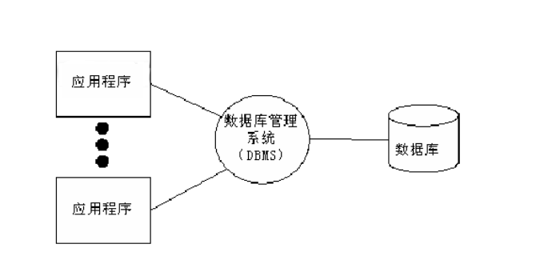

* 關係型數據庫和非關係型數據庫

  * 關係型數據庫

    採用關係模型（行列構成的二維表）來組織操作呈現數據的數據庫，也稱爲SQL數據庫。

    比如： MySQL、MariaDB、Oracle、SQL Server 等。

  * 非關係型數據庫

    沒有固定的表結構和關係模型，數據通常以鍵值對的形式存儲，也被稱爲NoSQL數據庫。

    比如：MongoDB、Redis等。

### 1.3 關於MariaDB

MariaDB是關係型數據庫，由MySQL的原創開發者在MySQL被甲骨文公司收購後創建的。

MariaDB的目標是成爲MySQL的替代品，因此它與MySQL具有很高的兼容性。

* 特點

  * 開源

  * 跨平臺（Windows、Linux、Mac）

  * 提供衆多語言的API：C、C++、Python、Java、Perl、PHP、Ruby等

  * 運行速度快

* 安裝

  詳見 `MariaDB安裝文檔`

### 1.4 數據庫管理系統常見概念

<font color=red>**DBMS - 庫 - 表 - 表記錄**</font>

**1）關係說明**

在DBMS數據庫管理系統中，可以根據不同的項目創建多個庫，在每個庫中可以根據項目需求創建不同的數據表，數據表中存放的是具體的數據。

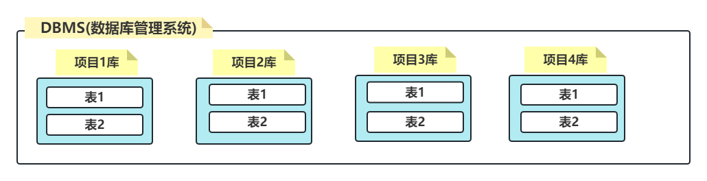

**2）庫 database**

是表的集合，一個庫中可以存放若干張表，通常庫服務於項目。


**3）表 table**

是數據的集合，具有一組相同屬性的數據存放在同一張表中。

行（row）：稱爲是 **記錄**，表中每一條數據

列（column）：稱爲是 **字段**，每一條記錄的屬性

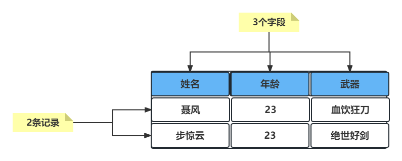


### 1.5 SQL語言

#### 1）數據庫角色

數據庫是一個獨立運行的軟件，並且是以 **服務端** 的形式體現的，我們要操作數據庫則需要以客戶端的角度與服務端建立連接並進行相關的操作。

#### 2）SQL語言

我們連接上數據庫後，向其發送 **SQL** 語句，數據庫理解該SQL語句的含義並執行相關操作並回饋結果。

* 什麼是SQL語言

  結構化查詢語言(Structured Query Language)，是一種數據庫查詢和程序設計語言，用於存取數據以及查詢、更新和管理關系數據庫。

* SQL語言特點

  - SQL語言基本上獨立於數據庫本身
  - 各種不同的數據庫對SQL語言的支持與標準存在着細微的不同
  - 每條命令最好以 ; 結尾
  - SQL語句不區分大小寫，但是好的書寫習慣：關鍵字大寫，非關鍵字小寫

#### 3）SQL分類

- **DDL**：數據定義語言，是操作數據庫對象的語言。數據庫對象（庫，表，視圖，索引，序列）

- **DML**：數據操作語言，是操作表中數據的語言。對表中數據操作的語言(增INSERT，刪DELETE，改UPDATE)
- **DQL**：數據查詢語言，是查詢表中數據的語言。SELECT語句(學習的重點和難點)
- **DCL**：數據控制語言，管理數據庫的語言(權限分配等，DBA關心的)
- **TCL**：事務控制語言，事務控制語言。


### 1.6 數據庫的連接方式

#### 1）常用的客戶端

- 命令行
- 圖形化界面
- JDBC
- 集成開發環境(IDE)

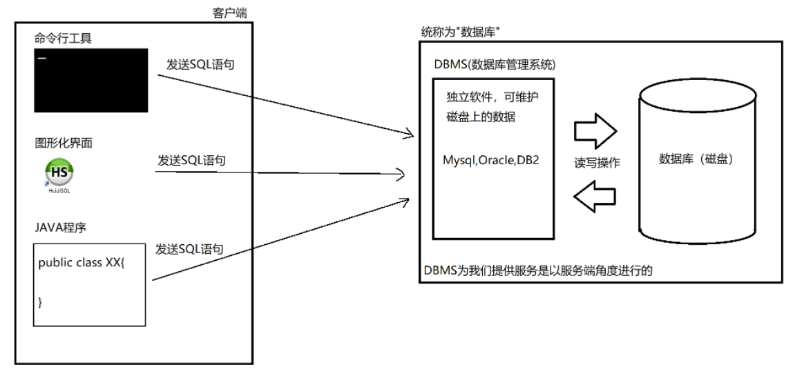

#### 2）IDEA連接MariaDB數據庫

第1步：點擊idea窗口右側 Database，在 Data Source 中選擇 MySQL

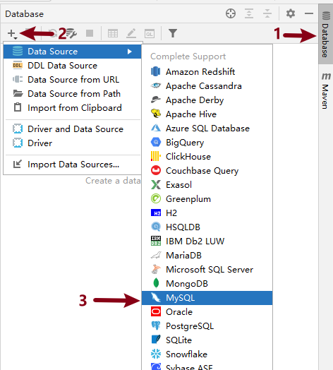

第2步：填寫連接名稱Name 或 描述Comment，輸入用戶名和密碼都爲root，首次連接需要下載驅動，點擊 Download

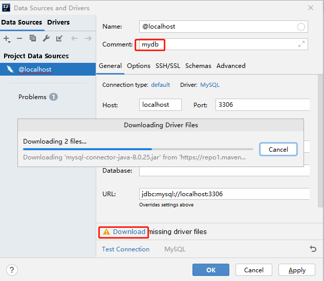

第3步：輸入SQL語句，選中後，可以點擊左上方 <font color=green>**綠色箭頭**</font> 執行SQL語句

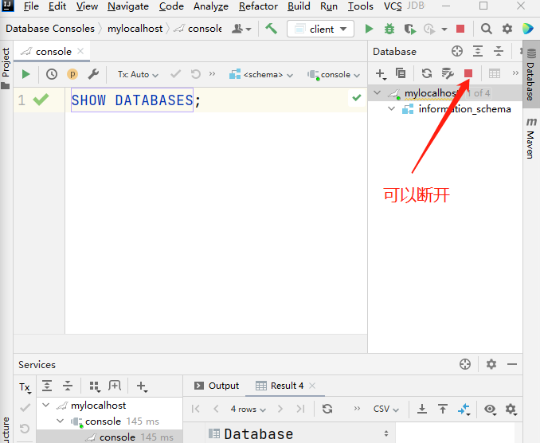


## 2 DDL數據定義語言

對數據庫對象進行操作的語言，涉及到的關鍵字CREATE、ALTER、DROP等

### 2.1 數據庫管理

#### 1）DDL指令

1. 查看已有庫

   ```mysql
   SHOW DATABASES;
   ```

2. 創建庫

   ```mysql
   CREATE DATABASE 數據庫名 [CHARSET=字符集];
   
   eg1. 創建數據庫mydb
   CREATE DATABASE mydb;
   
   eg2. 創建數據庫mydb1，指定字符集爲UTF8
   CREATE DATABASE mydb1 CHARSET=UTF8;
   
   eg3. 創建數據庫mydb2，指定字符集爲GBK
   CREATE DATABASE mydb2 CHARSET=GBK;
   ```

   > 注意：數據庫中標識符命名規則
   >
   > 1. 數字、字母、下劃線，但不要使用數字開頭
   > 2. 儘量不要使用特殊字符和mysql關鍵字
   > 3. 多個單詞使用下劃線連接，儘量見名知意

3. 查看創建數據庫時的信息

   ```mysql
   SHOW CREATE DATABASE 數據庫名;
   
   eg. SHOW CREATE DATABASE mydb;
   ```

4. 切換庫

   ```mysql
   USE 庫名;
   
   eg. 切換到數據庫mydb
   USE mydb;
   ```

5. 刪除庫

   ```mysql
   DROP DATABASE 庫名;
   
   eg. 刪除mydb庫
   DROP DATABASE mydb;
   ```

#### 2）課堂練習

1. 創建 db1和db2 數據庫 字符集分別爲utf8和gbk
2. 查詢所有數據庫檢查是否創建成功
3. 檢查兩個數據庫的字符集是否正確(查看創建時的SQL)
4. 先使用db2 再使用 db1
5. 刪除這兩個數據庫


### 2.2 數據表管理

#### 1）DDL指令

1. 創建表

   ```mysql
   CREATE TABLE 表名(
   	字段名名1 類型[(長度)] [DEFALUT 默認值] [約束],
       字段名名2 類型,
       ...
   )[CHARSET=字符集]
   ```

   eg.

   ```mysql
   # 1.創建庫mydb，並切換到該庫
   CREATE DATABASE mydb;			# 創建數據庫mydb
   USE mydb;						# 切換到mydb，後面創建表都是創建到這個庫中
   
   # 2.創建一張表user，保存用戶信息(用戶名，密碼，暱稱，年齡)
   CREATE TABLE user(
   	id INT,					# 整型
       username VARCHAR(32),   # 字符類型，長度爲最大字符數，即不能超過32個字符
       password VARCHAR(32),   # 字符類型，字符長度最大不能超過32個
       nickname VARCHAR(32),
       age INT                 # 整型
   )
   ```


2. 查看當前庫中所有數據表

   ```mysql
   SHOW TABLES;
   ```

   

3. 查看表結構

   ```mysql
   DESC 表名;
   
   eg. 查看user表的表結構
   DESC user;
   ```


4. 查看數據表創建信息

   ```mysql
   SHOW CREATE TABLE 表名;
   
   eg. 查看user表的創建信息[字符編碼]
   SHOW CREATE TABLE user;
   ```


5. 修改表名

   ```mysql
   RENAME TABLE 原表名 TO 新表名;
   
   eg. 將user表重命名爲 userinfo 表
   RENAME TABLE user TO userinfo
   ```

   

6. 刪除表

   ```mysql
   DROP TABLE 表名;
   
   eg. 刪除user表
   DROP TABLE user;
   ```


#### 2）課堂練習

1. 創建數據庫mydb3 字符集utf8 並使用
2. 創建t_hero英雄表, 有名字和年齡字段
3. 修改表名爲hero
4. 查看表hero的信息
5. 查詢表hero結構
6. 刪除表hero
7. 刪除數據庫mydb3


#### 3）修改表結構ALTER

準備一張表hero

```sql
CREATE TABLE hero(
	name VARCHAR(32),
	age INT(3)
);
```


1. 添加字段 - ADD

   * 表末尾追加字段

     `ALTER TABLE 表名 ADD 字段名 類型[(長度) 默認值 約束]; `

   * 表起始追加字段

     `ALTER TABLE 表名 ADD 字段名 類型 FIRST;`

   * 指定位置追加字段

     `ALTER TABLE 表名 ADD 字段名 類型 AFTER 表中現有字段名;`

   * 示例

     ```mysql
     1. 向表hero的末尾添加一個新字段gender，它的類型是字符串，最大寬度爲10
        ALTER TABLE hero ADD gender VARCHAR(10);
        
     2. 在hero表最開始添加id字段，類型爲int
        ALTER TABLE hero ADD id INT FIRST;
        
     3. 在name字段後面添加密碼pwd字段
        ALTER TABLE hero ADD pwd VARCHAR(32) AFTER name;
     ```

     

2. 刪除字段 - DROP

   ```mysql
   ALTER TABLE 表名 DROP 字段名;
   
   eg.將hero表中的pwd字段刪除
   ALTER TABLE hero DROP pwd;
   ```

   

3. 修改字段數據類型 - MODIFY

   ```mysql
   ALTER TABLE 表名 MODIFY 字段名 新數據類型;
   
   eg.修改hero表中的name字段長度爲64
   ALTER TABLE hero MODIFY name VARCHAR(64);
   ```

   

4. 替換字段 - CHANGE

   ```mysql
   ALTER TABLE 表名 CHANGE 舊字段名 新字段名 新數據類型;
   
   eg.修改hero表中的gender字段，改名爲nickname 類型爲字符串，最大寬度爲32
   ALTER TABLE hero CHANGE gender nickname VARCHAR(32);
   ```

   

* 修改表結構的注意事項

  - 修改表結構最好是在表中沒有數據的情況下進行

  - 當表中含有數據時
    - 儘量不修改表中某字段的類型，否則可能因爲現有數據不滿足新修改的類型導致修改失敗
    - 儘量不縮短字段長度
    - 若爲字段新添加約束，該字段現有的數據不能違反該約束


#### 4）綜合練習

1. 創建數據庫mydb4 字符集utf8並使用
2. 創建teacher表 有名字(name)字段
3. 添加表字段: 最後添加age 最前面添加id(int型) , age前面添加salary工資(int型)
4. 刪除age字段
5. 修改表名爲t
6. 刪除表t
7. 刪除數據庫mydb4


## 3 DML表記錄管理

**DML是對表中數據** 進行操作的語言，涉及的關鍵字：**INSERT UPDATE DELETE**

- INSERT

  向表中插入新數據的語句

- UPDATE

  修改表中數據的語句

- DELETE

  刪除表中數據的語句
  
  

**準備工作**

```sql
USE mydb;					# 使用mydb庫
CREATE TABLE person(		# 創建表person
	name VARCHAR(30),
    age INT
)
```


### 3.1 插入數據INSERT

<font color=red>**向數據表中插入數據**</font>

#### 1）語法

* **全列插入**

  在INSERT語句中不指定字段時，爲全列插入，此時要求VALUES子句後面 **指定的值的個數，順序，類型必須與表結構中字段完全一致**

  ```mysql
  INSERT INTO 表名 VALUES(值1,值2,...)	# 要求VALUES子句中指定的值必須與表結構一致
  
  eg. 在person表中插入1條數據
  INSERT INTO person VALUES('張三',12);
  
  補充：查詢表中數據
  SELECT * FROM person;
  ```

  

* **選擇字段插入**

  ```mysql
  INSERT INTO 表名 (字段1,字段2,字段3,...) VALUES (值1,值2,值3,...);
  向表中插入一條記錄，將值1插入的到字段1中，將值2插入到字段2中
  
  eg.
  INSERT INTO person (name,age) VALUES ('李四',22);
  INSERT INTO person (age,name) VALUES (33,'王五');
  INSERT INTO person (name) VALUES ("趙六");
  ```

  > 注意
  >
  > 1. 在數據庫中，**字符串的字面量** 是使用 **單引號括起來**的，需要注意
  >
  > 2. 在INSERT語句中 **指定的字段** 與VALUES後面 **指定的值** 的 **順序、個數、類型要完全一致**
  >
  > 3. 在INSERT語句中字段指定時的順序和個數可以與表結構定義時不一致

  

* **批量插入**

  一次在數據表中插入多條記錄

  ```mysql
  INSERT INTO 表名(字段...) VALUES(第一組值...),(第二組值...),....;
  
  eg.一次插入三條記錄
  INSERT INTO person(name,age) VALUES('阿貓',11),('阿狗',22),('阿三',33);
  ```

  

#### 2）關於默認值

INSERT語句中指定字段時，忽略的字段會被插入默認值。**當表中字段沒有被明確指定默認值時，默認值一律爲NULL**

使用 `DEFAULT` 關鍵字來爲字段指定默認值，可以在創建表時，也可以在修改表時指定

* 創建表時指定默認值

  ```mysql
  CREATE TABLE person(
  	name VARCHAR(30) DEFAULT '無名氏',
  	age INT(3) DEFAULT 30
  )
  ```

* 修改表時爲字段指定默認值

  ```mysql
  ALTER TABLE person MODIFY name VARCHAR(30) DEFAULT '無名氏';
  ```

* 測試

  此時向person表中插入數據時，若不指定name字段，該字段默認值插入'無名氏'

  ```mysql
  INSERT INTO person (age) VALUES (55);
  ```

  

### 3.2 更新數據UPDATE

<font color=red>**修改表數據**</font>

#### 1）語法

```sql
UPDATE 表名
SET 字段1=新值,字段2=新值,...
[WHERE 過濾條件];
```

**示例**

```sql
UPDATE person
SET age=40;
此時該SQL執行後，person表中每條記錄的age字段都會被改爲40
```

**注:當UPDATE語句中不添加WHERE子句時，會將表中所有記錄進行修改，這種操作實際開發中很少見**


#### 2）WHERE子句

當UPDATE語句添加了WHERE子句時，只有滿足WHERE子句要求的記錄才會被修改

**示例1：將張三的年齡修改爲22**

```sql
UPDATE person
SET age=22
WHERE name='張三';

數據庫在修改記錄時對表是逐行進行的，每一行是否進行修改取決於該行記錄是否滿足WHERE子句的條件要求
```


**示例2：將40歲的人改爲36歲**

```sql
UPDATE person
SET age=36
WHERE age=40;
```


**示例3：將李四的名字改爲'李老四'，年齡改爲66**

```mysql
UPDATE person
SET name='李老四',age=66
WHERE name='李四';
```


#### 3）WHERE子句基礎條件

WHERE子句會在後面DQL中詳細展開介紹

WHERE中基礎條件：**>, >=, <, <=, =, !=**

**示例1：將年齡高於30歲的人改爲29**

```sql
UPDATE person
SET age=29
WHERE age>30;
```


#### 3）使用表達式修改

將每個人的年齡漲一歲

```sql
UPDATE person
SET age=age+1;
```


### 3.3 刪除數據DELETE

<font color=red>**刪除表中數據**</font>

#### 1）語法

```sql
DELETE FROM 表名
[WHERE 過濾條件];
```

**注:DELETE語句通常不會忽略WHERE子句，否則是清空表操作!**

**示例**

```sql
刪除person表中'李老四'
DELETE FROM person
WHERE name='李老四';			# 僅刪除person表中name字段爲'李老四'的記錄

刪除年齡小於25歲的人
DELETE FROM person
WHERE age<25;
```


#### 2）清空表

```sql
DELETE FROM person
```


#### 3）DML總結

- INSERT語句，向表中插入數據的語言
  - INSERT語句指定的字段順序，個數可以與表結構不一致，但是VALUES子句後指定的值必須與指定的字段順序，類型，個數完全一致
  - INSERT語句在指定字段時，可以忽略某些字段，此時插入數據時被忽略的字段會插入默認值
  - INSERT語句中可以使用關鍵字 **NULL** 顯示聲明插入NULL值
  - INSERT語句中不指定字段時爲全列插入，此時VALUES後指定的值的順序，個數，類型要與表結構完全一致。實際開發中不推薦這樣的寫法。
- UPDATE語句，修改表中記錄的語言
  - UPDATE語句通常要指定WHERE子句，如果不指定則爲全表修改
- DELETE語句，刪除表中記錄的語言
  - DELETE語句通常要指定WHERE子句，**否則是清空表操作**


#### 4）綜合練習

1. 創建數據庫day2db 字符集utf8並使用

2. 創建t_hero表, 有name字段,字符集utf8

3. 修改表名爲hero

4. 最後面添加價格字段money(整數類型), 最前面添加id字段(整數類型), name後面添加  age字段(整數類型)

5. 表中添加以下數據: 

   1,李白,50,6888    

   2,趙雲,30,13888    

   3,劉備,25,6888

6. 修改劉備年齡爲52歲

7. 修改年齡小於等於50歲的價格爲5000

8. 刪除價格爲5000的信息

9. 刪除表, 刪除數據庫


## 4 數據類型

設計一張表時，要爲表中每一個字段指定類型以確保該字段可以保存正確類型的數據

### 4.1 數值類型

#### 1）整數類型

* INT類型

  佔用4個字節，保存範圍+-21億

* BIGINT類型

  佔用8個字節

#### 2）浮點數類型

* DOUBLE(M,N)

  - M是一個數字，表示數字的總位數

  - N是一個數字，表示小數位的位數

  - DOUBLE(7,2)  可以保存一個7位數，其中2爲是小數，整數5位


* 示例

  ```mysql
  CREATE TABLE person1(
  	age INT,					
      salary DOUBLE(7,2)			# 最大99999.99
  );
  ```

- 插入小數

  ```sql
  INSERT INTO person1(salary) VALUES(99999.99);
  ```

- 如果小數位的精度超過了允許精度時，會進行四捨五入

  ```sql
  INSERT INTO person1(salary) VALUES(1234.867);
                                            ^7會進行四捨五入
  實際插入表中後，該記錄salary字段的值位1234.87                                          
  ```

- 如果四捨五入後得到的值超過了該字段可以保存的最大值時會報錯

  ```sql
  INSERT INTO person1(salary) VALUES(99999.997);
  ```

  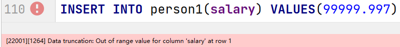

  

### 4.2 字符類型

#### 1）定長字符串

**CHAR類型是定長字符串**

- CHAR(m):m是一個數字，表示長度，**單位是字符**。m最大可取255

- CHAR類型在磁盤中開闢的長度是固定的。

- 優點：在磁盤中保存每條記錄的長度是固定的，因此讀取速度快

- 缺點：在磁盤中佔用空間固定，無論實際保存數據多少，都要佔夠空間，因此對磁盤空間有浪費


#### 2）變長字符串

**VARCHAR類型**

- VARCHAR(m)：m是一個數字，表示字符串的長度
- 實際佔用磁盤空間按照實際保存的數據而定
- 優點：由於磁盤空間佔用取決於實際保存的數據，因此不造成磁盤空間浪費
- 缺點：由於數據長度不一致，會導致讀取效率低

##### TEXT類型

- TEXT(m):m是一個數字，m最大值爲65535


### 4.3 日期類型

- **DATE** 用於保存年月日
- **TIME** 用於保存時分秒
- **DATETIME** 用於保存年月日時分秒
- **TIMESTAMP** (時間戳)，保存UTC時間，記錄自1970年元旦至表示的時間所經過的毫秒


**示例**

```sql
CREATE TABLE userinfo(
	id INT,						# id整數類型
    name VARCHAR(30),			# name字符串類型，最大寬度爲30
    gender CHAR(1),				# gender字符串類型，最多1個字符
    birth DATETIME,				# birth日期類型，保存年月日時分秒
    salary DOUBLE(7,2)			# salary浮點數類型，最多保存99999.99
);
```

- 插入一個日期類型的數據時，DATETIME類型爲例(可以保存年月日時分秒)，可以使用字符串來表示，但是格式必須爲"yyyy-MM-dd hh:mm:ss"(M表示月，m表示分)

  ```sql
  INSERT INTO userinfo(id,name,gender,birth,salary)
  VALUES(1,'張三','男','1998-08-03 10:22:35',5000.65);
  ```

  

## 5 約束條件

我們可以爲表添加約束條件，可以限制對錶的操作必須符合我們施加的約束條件，否則數據庫會拒絕該操作

### 5.1 主鍵約束PrimaryKey

#### 1）主鍵約束

- 主鍵約束要求該字段的值必須 **非空且唯一**

- 主鍵約束一般會爲表中第一個字段添加，並且通常該字段取名爲"id"

- 示例

  ```mysql
  CREATE TABLE user1(
  	id INT PRIMARY KEY,		# 爲id字段添加主鍵約束
  	name VARCHAR(30),
  	age INT
  );
  
  INSERT INTO user1 (id,name,age) VALUES(1,'張三',22),(2,'李四',33);
  ```

  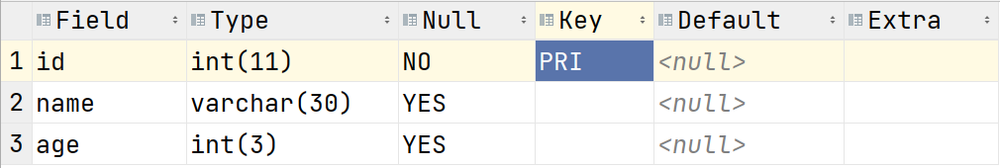

  <font color=red>主鍵字段不能插入重複的值，並且在修改表記錄時，也不可以將重複的值修改到主鍵字段。</font>


#### 2）自增長

具有主鍵約束的字段通常主鍵的生成方式由系統完成，而自增就是其中一種方式

**示例**

- 創建表時爲主鍵字段添加自增

  ```sql
  CREATE TABLE user2(
  	id INT PRIMARY KEY AUTO_INCREMENT,
      name VARCHAR(30),
      age INT(3)
  )
  ```

  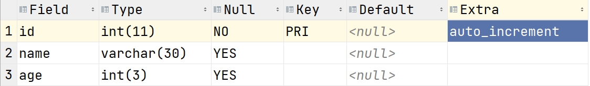

  

- 當主鍵字段具有自增時，插入數據則可以忽略主鍵字段

  ```sql
  INSERT INTO user2(name,age) VALUES('張三',33);
  INSERT INTO user2(name,age) VALUES('李四',26)
  ```

  

- 當主鍵字段具有自增時，可以顯示的向主鍵中插入NULL值，但此時主鍵字段仍然使用自增

  ```sql
  INSERT INTO user2(id,name,age) VALUES(NULL,'王五',45);
  ```

  

### 5.2 非空約束(NOT NULL)

被非空約束施加的字段，該字段的值不能爲NULL

**示例**

- 創建表時爲字段添加非空約束

  ```sql
  CREATE TABLE user3(
  	id INT PRIMARY KEY AUTO_INCREMENT,
      name VARCHAR(30) NOT NULL,				# name字段施加非空約束
      age INT
  )
  ```

  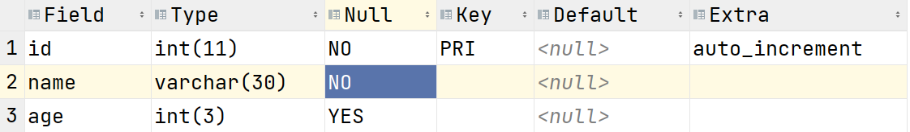

  

- 插入數據時，不能向具有非空約束的字段中插入NULL值

  ```sql
  INSERT INTO user3(name,age) VALUES(NULL,22);	# 不可以將NULL值插入name字段
  ```

  

### 5.3 唯一性約束(UNIQUE)

具有唯一性約束的字段值不允許重複，但是可以爲NULL。

**示例**

- 創建表時爲字段添加唯一性約束

  ```
  CREATE TABLE user4(
  	id INT PRIMARY KEY AUTO_INCREMENT,
  	name VARCHAR(30) UNIQUE,
      age INT
  )
  ```

  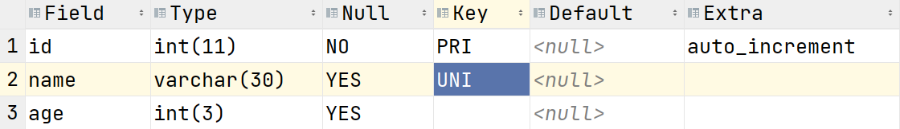

  

- 插入數據時，不可以將重複的值插入到具有唯一性約束的字段中

  ```sql
  INSERT INTO user4(name,age) VALUES('張三',22);	# 可以
  INSERT INTO user4(name,age) VALUES('張三',45);	# 不可以再次插入'張三'到name字段
  ```

  


### 5.4 檢查約束(CHECK)

檢查約束允許我們自定義約束條件，僅當滿足我們指定的條件才可以進行操作

**示例**

- 創建表時添加CHECK約束

  ```SQL
  CREATE TABLE user5(
  	id INT PRIMARY KEY AUTO_INCREMENT,
  	name VARCHAR(30),
  	age INT CHECK(age>0 AND age<120)			# 要求age字段的值>0且<120
  );
  ```

  

- 插入數據時，age字段的取值必須符合CHECK約束

  ```sql
  INSERT INTO user5(name,age) VALUES('張三',22);	# 成功
  INSERT INTO user5(name,age) VALUES('李四',160);	# 失敗
  ```

  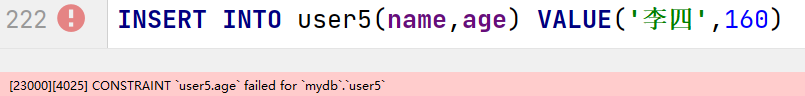


### 5.5 外鍵約束(瞭解)

#### A）外鍵約束

- 外鍵約束

  外鍵約束是一種限制，它通過對錶的行或列的數據做出限制，來確保表的數據的完整性、關聯性

- 功能

  建立表與表之間的某種約束的關係，由於這種關係的存在，能夠讓表與表之間的數據，更加的完整，關連性更強，爲了具體說明創建如下部門表和人員表。

- 示例

  ```mysql
  -- 創建部門表
  CREATE TABLE dept
  (
      id    int PRIMARY KEY auto_increment,
      dname VARCHAR(50) not null
  );
  
  INSERT INTO dept
  VALUES (1, "技術部"),
         (2, "銷售部"),
         (3, "市場部"),
         (4, "行政部"),
         (5, '財務部'),
         (6, '總裁辦公室');
  
  -- 創建人員表
  CREATE TABLE emp
  (
      id      int PRIMARY KEY AUTO_INCREMENT,
      name    varchar(32) NOT NULL,
      age     tinyint,
      salary  double(8, 2),
      dept_id int
  );
  
  INSERT INTO emp
  VALUES (1, "Lily", 29, 20000, 2),
         (2, "Tom", 27, 16000, 1),
         (3, "Joy", 30, 28000, 1),
         (4, "Emma", 24, 8000, 4),
         (5, "Abby", 28, 17000, 3),
         (6, "Jame", 32, 22000, 3);
  ```

  上面兩個表中每個人員都應該有指定的部門，但是實際上在沒有約束的情況下人員是可以沒有部門的或者也可以添加一個不存在的部門，這顯然是不合理的。

* 主表和從表

  若同一個數據庫中，B表的外鍵與A表的主鍵相對應，則A表爲主表，B表爲從表。


#### B）語法

foreign key 外鍵的定義語法：

```sql
[CONSTRAINT symbol] FOREIGN KEY(外鍵字段) 
REFERENCES tbl_name (主表主鍵)
[ON DELETE {RESTRICT | CASCADE | SET NULL}]
[ON UPDATE {RESTRICT | CASCADE | SET NULL}]
```

* 創建表時指定外鍵

  ```mysql
  -- 創建表時直接建立外鍵
  CREATE TABLE emp
  (
      id      INT PRIMARY KEY AUTO_INCREMENT,
      name    VARCHAR(32) NOT NULL,
      age     INT,
      salary  DOUBLE(10, 2),
      dept_id INT,
      CONSTRAINT dept_fk FOREIGN KEY (dept_id) REFERENCES dept (id)
  );
  ```

* 修改表時添加外鍵

  ```mysql
  ALTER TABLE emp
      ADD CONSTRAINT dept_fk FOREIGN KEY (dept_id) REFERENCES dept (id);
  ```

* 通過外鍵名稱解除外鍵約束

  ```mysql
  ALTER TABLE emp DROP FOREIGN KEY dept_fk;
  ```

  

#### C）級聯動作

- RESTRICT(默認)  :  `ON DELETE RESTRICT ON UPDATE RESTRICT`

  - 當主表刪除記錄時，如果從表中有相關聯記錄則不允許主表刪除
  - 當主表更改主鍵字段值時，如果從表有相關記錄則不允許更改

- CASCADE：數據級聯更新  `ON DELETE CASCADE ON UPDATE CASCADE`

  - 當主表刪除記錄或更改被參照字段的值時,從表會級聯更新

    ```sql
    ALTER TABLE emp
        ADD
            FOREIGN KEY (dept_id)
                REFERENCES dept (id)
                ON DELETE CASCADE ON UPDATE CASCADE;
    ```

- SET NULL :  `ON DELETE SET NULL ON UPDATE SET NULL`

  - 當主表刪除記錄時，從表外鍵字段值變爲null

  - 當主表更改主鍵字段值時，從表外鍵字段值變爲null

    ```sql
    ALTER TABLE emp
        ADD
            CONSTRAINT dept_fk FOREIGN KEY (dept_id)
                REFERENCES dept (id)
                ON DELETE SET NULL ON UPDATE SET NULL;
    ```


## 6 IDEA中導入sql腳本文件

第1步：鼠標右鍵選擇tedu.sql文件,並進行配置

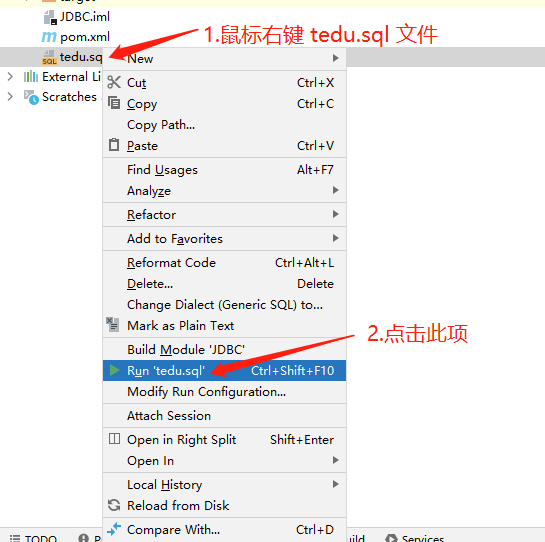


第2步：在彈出的配置窗口中點擊"+"來設置數據庫源,目的是在哪個數據庫中執行這個tedu.sql腳本

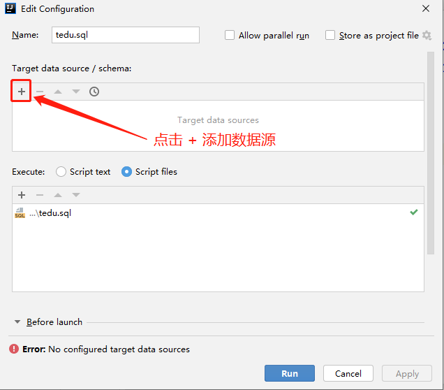


第3步：選擇我們配置的數據源後點擊Run按鈕

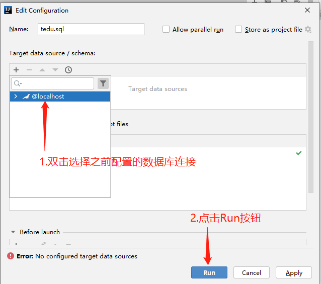


第4步：等待執行完畢即可

<font color=red>數據量較大，所以執行完畢需要一定時間，等待即可。</font>

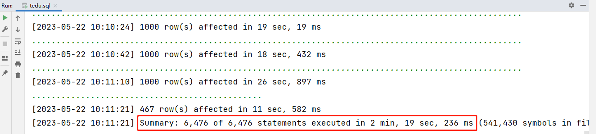


# 數據庫查詢

`tedu.sql` 數據表說明


## 1 DQL基本查詢	

DQL語言用來檢索表中數據的語言，涉及到的關鍵字SELECT

**語法**

```sql
						執行順序
SELECT 子句				6	
FROM 子句					1
JOIN... ON...子句			2
WHERE 子句				3
GROUP BY 子句				4
HAVING 子句				5
ORDER BY 子句				7
LIMIT 子句				8
```

### 1.1 基礎查詢

**語法**

```SQL
SELECT 字段1,字段2,... FROM 表名;
```

- SELECT 子句用於指定查詢表中的字段
- FROM子句用於指定數據來自那張表

**示例**

- 查詢表中所有字段，以及指定字段

  ```sql
  USE tedu;
  
  eg1. 檢索teacher表中的所有字段的所有記錄
  SELECT * FROM teacher;
  
  eg2. 檢索所有老師的id、姓名和年齡
  SELECT id,name,age FROM teacher;
  ```
  
  > 注意
  >
  > 實際開發中，**java代碼若執行DQL語句**，**儘量不要用"*" **.
  >
  > 因爲當使用SELECT * 時數據庫首先要查詢數據字典瞭解待查詢表的表結構，瞭解全字段後才能進行查詢。因此會給數據庫帶來額外的開銷，這不划算。因爲java代碼僅需要編寫一次，因此我們應當在SELECT後將所有字段列出。
  
  

### 1.2 WHERE子句

在DQL語句中，WHERE同樣用於指定過濾條件，此時僅將滿足該過濾條件的記錄查詢出來

**示例**

- 查看"一級講師"的信息，列出:名字，職位，工資，年齡

  ```sql
  SELECT name,title,salary,age
  FROM teacher
  WHERE title='一級講師';
  ```
  
- 查看除了"劉蒼松"以外的所有老師的名字，工資，獎金，職位

- 查看職位是"大隊長"的學生的名字,年齡,性別?

- 查看年齡在30歲以上(含)的老師的名字,職稱,工資,獎金


#### 1）算術運算符

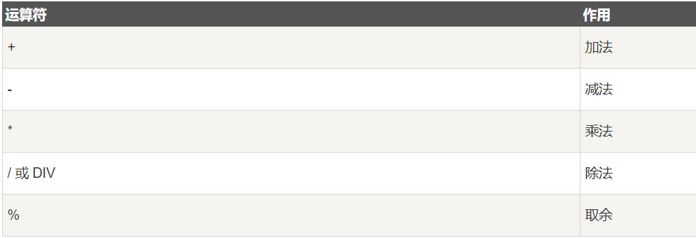

eg1：查找年齡爲偶數的老師信息

```mysql
SELECT * FROM teacher 
WHERE age%2=0;
```

eg2：查看年薪高於60000的老師都有誰?

```sql
SELECT name,salary
FROM teacher
WHERE salary*12>60000;
```


#### 2）邏輯運算符

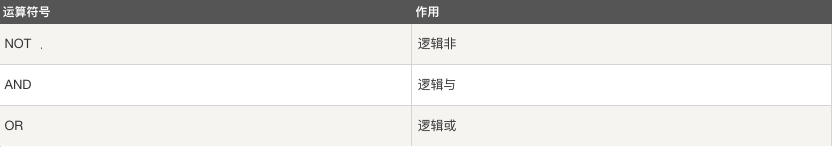

* 邏輯運算符說明
  * AND："與"，都爲真時才爲真
  * OR："或"，都爲假時才爲假

- 示例

  - 查看7歲的"大隊長"都有誰?列出這些學生的名字,年齡,性別和職位

    ```sql
    SELECT name,age,gender,job
    FROM student
    WHERE age=7 AND job='大隊長';
    ```


  - 查看班級編號小於6的所有中隊長都有誰?列明名字，年齡，性別，班級編號(class_id)，職位

    ```sql
    SELECT name,age,gender,class_id,job
    FROM student
    WHERE class_id<6 AND job='中隊長';
    ```


  - 查看所有一級講師和三級講師的名字，職稱，工資?

    ```sql
    SELECT name,title,salary
    FROM teacher
    WHERE title='一級講師' OR title='三級講師';
    ```


  - 查看所有大隊長，中隊長和小隊長的名字，性別，年齡和職位?

    ```sql
    SELECT name,gender,age,job
    FROM student
    WHERE job='大隊長' OR job='中隊長' OR job='小隊長';
    ```


* 關於`AND` 和 `OR` 的優先級

  AND的優先級高於OR，爲了提高OR的優先級，可以使用小括號 "()"

  - 查看班級編號在6(含)以下的所有大隊長和中隊長的名字，年齡，性別，班級編號和職位

    ```sql
    SELECT name,age,gender,class_id,job
    FROM student
    WHERE class_id<=6 AND job='大隊長' OR job='中隊長';
        # 班級編號在6以下的所有大隊長    或者  所有班級的中隊長
          
          
    SELECT name,age,gender,class_id,job
    FROM student
    WHERE class_id<=6 AND (job='大隊長' OR job='中隊長');
    # 使用()來提高OR的優先級達到查詢需求
    ```


#### 3）比較運算符


##### A）BETWEEN... AND ...

在一個範圍內

**示例**

- 查看工資在2000到5000之間的老師的名字,性別,年齡,工資

  ```sql
  SELECT name,gender,age,salary
  FROM teacher
  WHERE salary>=2000 AND salary<=5000;
  
  等價於
  
  SELECT name,gender,age,salary
  FROM teacher
  WHERE salary BETWEEN 2000 AND 5000;
  ```

- 查看年齡 **除了** 8到10歲的學生的名字，性別，年齡

  ```sql
  SELECT name,gender,age
  FROM student
  WHERE age NOT BETWEEN 8 AND 10;
  ```

- 查看年齡在20到35之間的男老師都有誰？列出名字，性別，年齡，職稱

- 查看所有在3-5層的班級都有哪些？列出班級名稱和所在樓層

  

##### B）IN(列表)

* IN(列表)：等於列表其中之一

* NOT IN(列表)：不在列表中

**示例**

- 查看所有大隊長，中隊長和小隊長的名字，性別，年齡和職位?

  ```sql
  SELECT name,gender,age,job
  FROM student
  WHERE job='大隊長' OR job='中隊長' OR job='小隊長';
  
  等價於
  
  SELECT name,gender,age,job
  FROM student
  WHERE job IN('大隊長','中隊長','小隊長');
  ```

- 查看所有一級講師，二級講師，三級講師的名字，職稱，工資和性別

  ```sql
  SELECT name,title,salary,gender
  FROM teacher
  WHERE title IN ('一級講師','二級講師','三級講師');
  ```

- 查看除一級講師和二級講師之外的所有老師的名字，職稱，工資

  ```sql
  SELECT name,title,salary
  FROM teacher
  WHERE title NOT IN('一級講師','二級講師');
  ```
  
- 查看除大隊長，中隊長，小隊長的其他學生的名字，職位，性別，年齡


##### C）NULL值判斷

判斷一個字段值是否爲NULL

- IS NULL：判斷字段的值是否爲NULL

- IS NOT NULL：判斷字段的值是否不是NULL

  **不可以用 = 和 != 判斷NULL值**

**示例**

- 查看哪些老師的獎金爲空?

  ```sql
  SELECT name,salary,comm
  FROM teacher
  WHERE comm IS NULL;
  ```

- 查看有獎金的老師?

  ```sql
  SELECT name,salary,comm
  FROM teacher
  WHERE comm IS NOT NULL;
  ```


#### 4）綜合練習

1. 查看負責課程編號(subject_id)爲1的男老師都有誰?
2. 查看工資高於5000的女老師都有誰?
3. 查看工資高於5000的男老師或所有女老師的工資？
4. 查看所有9歲學生的學習委員和語文課代表都是誰?
5. 查看工資在6000到10000之間的老師以及具體工資?
6. 查看工資在4000到8000以外的老師及具體工資?
7. 查看老師負責的課程編號都有什麼?
8. 查看所有女老師的職稱都是什麼?
9. 查看7-10歲的男同學的職位都有哪些?
10. 查看一級講師和二級講師的獎金(comm)是多少?
11. 查看除老闆和總監的其他老師的工資和獎金是多少?
12. 查看'3年級2班'和'5年級3班'在那層樓?


## 2 DQL高級查詢

### 2.1 LIKE 模糊查詢

LIKE有兩個可用的通配符

- _：表示任意一個字符。確切的數量**表示1個字符**
- %：表示任意個字符。不確切的數量**表示0-任意個字符**

**格式示例**

```SQL
LIKE '%X%' 	表示字符串中包含字符X
LIKE '_X%' 	表示字符串中第二個字符是X
LIKE 'X%'  	表示字符串以X開始
LIKE '%X'  	表示字符串以X結束
LIKE '%X_Y'	表示字符串倒數第三個字符數X並且最後一個字符是Y
```

**示例**

- 查看名字中含有'蒼'的老師又有誰?

  ```sql
  SELECT name,title,salary
  FROM teacher
  WHERE name LIKE '%蒼%';
  ```

- 查看姓張的學生都有誰?

- 查看三個字名字中第二個字是'平'的學生都有誰?

- 查看最後一個字是'晶'的老師都有誰?

- 查看哪些學生是課代表?列出他的名字和職位

- 查看所有的2班都在哪層?


**練習**

1. 查詢名字姓"李"的學生姓名
2. 查詢名字中包含"江"的學生姓名
3. 查詢名字以"郭"結尾的學生姓名
4. 查詢9-12歲裏是"課代表"的學生信息
5. 查詢名字第二個字是"苗"的學生信息
6. 查詢姓"邱"的課代表都是誰?


### 2.2 AS 別名

語法格式：字段名<空格>別名

別名通常使用在SELECT子句和FROM子句中

- 在SELECT子句中我們可以爲字段取別名。
  - 當字段爲函數或表達式時，我們通常給字段添加別名，爲了增加可讀性
  - 爲SELECT中的子查詢取別名
- 在FROM 子句中可以爲表添加別名


eg1：查詢字段重命名

查詢所有老師的姓名、工資和年薪

```mysql
# AS 關鍵字可以省略不寫
SELECT name,salary,salary*12 AS annusal
FROM teacher;
```


eg2：表重命名

```mysql
# AS 關鍵字可以省略不寫
SELECT t.name, t.salary, salary*12 AS annusal
FROM teacher AS t;
```


### 2.3 ORDER BY排序

ORDER BY子句用於對查詢結果集進行排序，可以按照ORDER BY後指定的字段值進行升序或降序排序

- 升序：ORDER BY 字段 [ASC]

  將當前結果集按照指定的字段值從小到大排序。

- 降序：ORDER BY 字段 DESC

  將當前結果集按照指定的字段值從大到小排序。

- ORDER BY可以按照多個字段排序，此時排序存在優先級。
  - 首先按照ORDER BY後指定的第一個字段的值將結果集按照該字段排序方式(升序或降序)排序
  - 排序後再按照第二個字段指定的值排序，**僅會對第一個字段值相同的記錄按照第二個字段排序**
  - 若有第三個字段以此類推
  
- 不指定排序方式時，默認爲升序

  

**示例**

- 查看老師的工資排名,從多到少

  ```sql
  # 將結果集按照salary的降序進行排序
  SELECT name,salary
  FROM teacher
  ORDER BY salary DESC;
  ```

- 查看老師獎金的排名?

  ```sql
  SELECT name,comm
  FROM teacher
  ORDER BY comm DESC;
  ```

- 查看學生的生日,按照從遠到近

  ```sql
  # 日期是可以比較大小的，規則"遠小近大"
  SELECT name,birth
  FROM student
  ORDER BY birth;
  ```

- 查看7-10歲的學生信息,學生按照年齡從大到小排序(同年齡的看生日)

  ```sql
  SELECT name,age,birth
  FROM student
  WHERE age BETWEEN 7 AND 10
  ORDER BY birth;
  ```

- 查看老師的工資和獎金，首先按照獎金的升序，再按照工資的降序

  ```sql
  SELECT name,comm,salary
  FROM teacher
  ORDER BY comm ASC,salary DESC;  # 每個字段都要單獨指定排序方式
  
  多字段排序時，首先將結果集按照comm的排序方式排序，之後將comm字段值相同的記錄再按照salary的方式排序
  當comm字段值不同的記錄，則不會再按照salary字段排序
  ```
  
  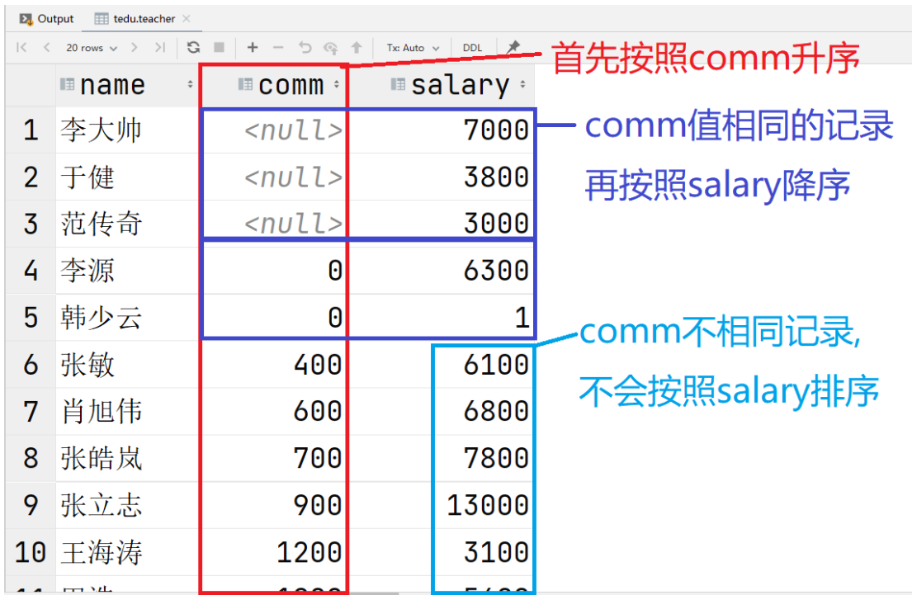


### 2.4 LIMIT分頁查詢

LIMIT 子句用於限制由 SELECT 語句返回的數據數量 或者 UPDATE,DELETE語句的操作數量

#### 1）使用場景

當一條DQL語句可以查詢出非常大量的數據時，我們可以分批將數據查詢，例如淘寶檢索一件商品時，分出現第一頁，第二頁等信息，每頁展示30條記錄。一次僅查詢30條記錄，避免因爲數據龐大導致系統過度的資源開銷。

#### 2）語法說明

```sql
SELECT ... 
FROM ...
WHERE ...
ORDER BY ...
LIMIT M,N;
```

- M：表示跳過結果集M條記錄
- N：表示從跳過的M條記錄後連續檢索N條記錄
- 在分頁查詢中有兩個常見的參數
  - 頁數:當前顯示第幾頁內容
  - 條目數:每頁顯示的條目數

- 分頁公式

  - M:(頁數-1)*條目數

  - N:條目數

  - ```
    例如:顯示第3頁，每頁顯示5條記錄
    M:(3-1)*5   ->M:10
    N:5         ->N:5    
    ```

    

#### 3）課堂示例

- 查看老師工資的前5名?

  ```sql
  SELECT name,salary
  FROM teacher
  ORDER BY salary DESC
  LIMIT 0,5;
  ```

- 查看老師獎金信息，按照降序排序後，每頁顯示3條，顯示第5頁?

  ```sql
  頁數:5   條目數:3
  - M:(頁數-1)*條目數   (5-1)*3->M:12
  - N:條目數
  
  SELECT name,comm
  FROM teacher
  ORDER BY comm DESC
  LIMIT 12,3;
  
  ```


#### 4）綜合練習

1. 查詢所有10歲學生的生日,按生日對應的年紀從大到小.
2. 查詢8歲同學中名字含有"苗"的學生信息
3. 查詢負責課程編號1和2號且工資高於6000的老師信息
4. 查詢10歲以上的語文課代表和數學課代表
5. 查詢不教課程編號1的老師信息,按照工資降序排序
7. 查詢所有老師的獎金，並按照獎金降序排序
8. 查看工資高於8000的老師負責的課程編號都有那些?
9. 查看全校年齡最小學生的第11-15名


## 3 聚合操作

聚合操作指的是在數據查找基礎上對數據的進一步整理篩選行爲，實際上聚合操作也屬於數據的查詢篩選範圍。

### 3.1 聚合函數

|     方法      |         功能         |
| :-----------: | :------------------: |
|  avg(字段名)  |    該字段的平均值    |
|  max(字段名)  |    該字段的最大值    |
|  min(字段名)  |    該字段的最小值    |
|  sum(字段名)  |  該字段所有記錄的和  |
| count(字段名) | 統計該字段記錄的個數 |

* 注意

  - MIN、MAX、SUM、AVG是對值的統計；而COUNT是對記錄數的統計

  - 聚合函數忽略NULL值；這個在AVG，COUNT上尤爲明顯


#### 1）聚合函數示例

- 查看老師的平均工資是多少?

  ```sql
  SELECT AVG(salary)
  FROM teacher;
  ```
  
- 查看老師的最高工資,最低工資,平均工資和工資總和都是多少?

  ```sql
  SELECT MAX(salary),MIN(salary),AVG(salary),SUM(salary)
  FROM teacher;
  ```
  
- 查看負責課程編號1的老師的平均工資是多少?

  ```sql
  SELECT AVG(salary)
  FROM teacher
  WHERE subject_id=1;
  ```
  
- 查看總共多少位老師?

  ```sql
  SELECT COUNT(name) FROM teacher;    # 統計name字段值不爲NULL的記錄共多少條
  SELECT COUNT(comm) FROM teacher;    # 因爲comm字段有NULL值，聚合函數忽略對NULL的統計
  SELECT COUNT(*) FROM teacher;       # DBMS基本都對COUNT(*)採取了優化
  ```

#### 2）課堂練習

1. 查看負責課程編號2的老師共多少人?
2. 查看班級編號(class_id)爲1的學生有多少人?
3. 查看全校學生生日最大的是哪天?
4. 查看11歲的課代表總共多少人?
5. 姓張的學生有多少人?
6. 工資高於5000的老師中最低工資是多少?
7. 4層有幾個班?
8. 老師中"總監"的平均工資是多少?


### 3.2 GROUP BY 分組

GROUP BY子句可以將結果集按照指定字段值相同的記錄進行分組，配合聚合函數可以實現組內統計。

- 在SELECT子句中出現聚合函數時，那麼不在聚合函數中的字段都要出現在GROUP BY子句中。
- GROUP BY子句是配合聚合函數使用的，如果SELECT子句中沒有聚合函數，通常不寫GROUP BY。

#### 1）單字段分組

**示例**

- 查看每種職位的老師平均工資是多少?

  ```sql
  SELECT AVG(salary),title
  FROM teacher
  GROUP BY title;
  ```

  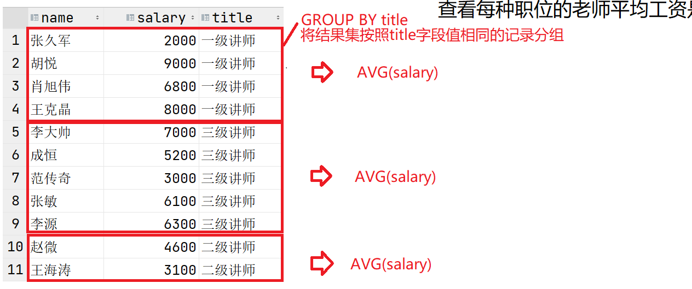

- 查看每個班級各多少人?

  ```sql
  班級號相同的學生應該是同一個班，因此按照班級號相同的記錄分組，組內求記錄數
  SELECT COUNT(*),class_id
  FROM student
  GROUP BY class_id;
  ```

- 查看學生每種職位各多少人,以及最大生日和最小生日?

  ```sql
  SELECT COUNT(*) '人數',MIN(birth) '最大生日',MAX(birth) '最小生日',job
  FROM student
  GROUP BY job;
  ```


#### 2）多字段分組

GROUP BY後面指定多個字段時，分組方式爲：這些字段值都一樣的記錄看作一組

**示例**

- 查看同班級同性別的學生分別多少人?

  ```sql
  SELECT COUNT(*),class_id,gender
  FROM student
  GROUP BY class_id,gender;   # 班級號相同且性別相同的記錄分爲一組
  ```

- 查看每個班每種職位各多少人?

  ```sql
  SELECT COUNT(*),class_id,job
  FROM student
  GROUP BY class_id,job;
  ```

  

#### 3）分組聚合排序

**示例**

- 查看每個科目老師的平均工資排名?

  ```sql
  SELECT AVG(salary) avg_sal,subject_id
  FROM teacher
  GROUP BY subject_id
  ORDER BY avg_sal DESC;
  ```


### 3.3 HAVING子句

HAVING子句用於分組中的過濾條件

**示例**

- 查看每個科目老師的平均工資?但是僅查看平均工資高於6000的那些.

  ```sql
  SELECT AVG(salary),subject_id
  FROM teacher
  WHERE AVG(salary)>6000
  GROUP BY subject_id;
  ```
  

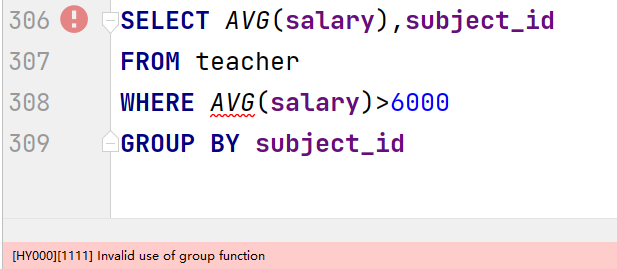

**錯誤**

聚合函數不能在WHERE子句中使用


#### 1）HAVING子句應用

HAVING子句是緊跟在GOURP BY子句之後，**用於對分組進行過濾的子句**。

#### 2）HAVING和WHERE的區別

- WHERE是在**第一次檢索表數據時**用於添加過濾條件，**確定結果集**

- HAVING是在**GROUP BY之後**(將結果集分組之後)添加過濾條件的，**用於確定分組**。

  

**示例**

- 查看每個科目老師的平均工資?但是僅查看平局工資高於6000的那些.

  ```sql
  								子句執行順序
  SELECT AVG(salary),subject_id		# 4	符合要求的分組統計對應信息
  FROM teacher						# 1	數據來源，數據從teacher表查詢
  GROUP BY subject_id					# 2 確定分組，按科目分組(比如6組)
  HAVING AVG(salary)>6000;			# 3 過濾分組，比如只有3組符合要求
  ```

- 查看每個科目老師的平均工資，前提是該科目老師最高工資要超過9000

  ```sql
  								執行順序
  SELECT AVG(salary),subject_id	# 4	查看符合要求的分組的統計結果
  FROM teacher					# 1	確定數據來源
  GROUP BY subject_id				# 2	確定分成幾組
  HAVING MAX(salary)>9000;		# 3	確定哪些分組符合要求
  ```
  
- 查看各科目男老師的平均工資是多少?前提是該科目老師最低工資高於4000.

  ```sql
  SELECT AVG(salary),subject_id
  FROM teacher
  WHERE gender='男'
  GROUP BY subject_id
  HAVING MIN(salary)>4000;
  ```


### 3.4 DISTINCT去重

DISTINCT可以將結果集按照指定的字段去除重複行；

DISTINCT必須緊跟在SELECT關鍵字之後。

**示例**

- 查看老師的職稱都有哪些?

  ```sql
  SELECT DISTINCT title
  FROM teacher;
  ```

- 查看學生都有哪些職位?

  ```sql
  SELECT DISTINCT job
  FROM student;
  ```

- 查看各年齡段的學生都有哪些職位?

  ```sql
  SELECT DISTINCT age,job		
  FROM student;
  當age與job值相同的記錄會被去除。例8歲的大隊長可能查出4個，但僅保留一個
  ```

  

## 4 子查詢 (SubQuery)

#### 1）引言

嵌套在一個SQL語句中的DQL語句，該DQL被稱爲子查詢

#### 2）應用場景

- DQL中使用子查詢
  - 在SELECT子句中，將當前子查詢結果作爲一個字段展示
  - 在WHERE子句中，將當前子查詢結果作爲過濾條件使用(最常用的場景)
- DML中使用:將一個查詢結果集用於增刪改操作

#### 3）子查詢分類

- 單行單列子查詢，該子查詢的結果集只有一個值
- 多行單列子查詢，該子查詢結果集是多個值
- 多行多列子查詢，將該子查詢當作一張表使用


##### A）單行單列子查詢

**示例**

- 查看比範傳奇工資高的老師都有誰?

  ```sql
  1:未知條件:範傳奇的工資是多少?
  SELECT salary FROM teacher WHERE name='範傳奇';   # ==>3000
  
  2:誰的工資高於3000?
  SELECT name,salary FROM teacher WHERE salary>3000;
  
  在數據庫中，被嵌套的DQL需要使用()括起來
  SELECT name,salary 
  FROM teacher 
  WHERE salary>(SELECT salary FROM teacher WHERE name='範傳奇');
  ```
  
- 查看哪些老師的工資是高於平均工資的?

  ```sql
  1:未知條件  先查詢老師的平均工資是多少?
  SELECT AVG(salary) FROM teacher;
  
  2:查看高於平均工資
  SELECT name,salary
  FROM teacher
  WHERE salary>(SELECT AVG(salary) FROM teacher);
  ```

- 查看和'李費水'在同一個班的學生都有誰?

  ```sql
  SELECT name,class_id
  FROM student
  WHERE class_id=(SELECT class_id FROM student WHERE name='李費水');
  ```
  
- 查看工資最高的老師的工資和獎金是多少?

  ```sql
  SELECT name,salary,comm
  FROM teacher
  WHERE salary=(SELECT MAX(salary) FROM teacher);
  ```


##### B）多行單列子查詢

多行單列子查詢是可以檢索出若干個值。因此作爲過濾條件使用時，一般配合:**IN,NOT IN**使用。

因爲等於是不能同時等於好幾個值的，只能同於其中之一


**示例**

- 查看與"祝雷"和"李費水"在同一個班的學生都有誰?

  ```sql
  1:未知條件:"祝雷"和"李費水"的班級號是多少
  SELECT class_id FROM student WHERE name IN('祝雷','李費水');
  
  2:查看與他們班級號相同的學生
  SELECT name,class_id
  FROM student
  WHERE class_id=(SELECT class_id FROM student WHERE name IN('祝雷','李費水'))
  ```

  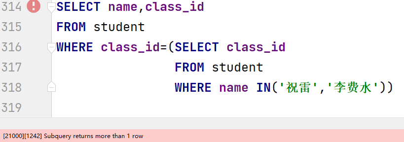

  

  **錯誤原因，兩個學生的班級號不同，而沒有任何一個學生的班級號可以同時等於兩個不同的值**

  ```sql
  SELECT name,class_id
  FROM student
  WHERE class_id IN (SELECT class_id 
                     FROM student 
                     WHERE name IN('祝雷','李費水'))
  ```

  

- 查看比教科目2和科目4老師工資都高的老師都有誰?

  ```sql
  SELECT name,salary,subject_id
  FROM teacher
  WHERE salary>(SELECT MAX(salary) FROM teacher WHERE subject_id IN(2,4))
  ```
  
  

##### C）多行多列子查詢

可以將一個查詢結果集當作一張表創建出來

**示例**

- 創建一張表,該表中記錄了每個科目老師的工資情況,要求展示:最高,最低,總和和平均工資以及該科目id

  ```sql
  CREATE TABLE teacher_salary_info
  AS
  SELECT MAX(salary) max_sal,MIN(salary) min_sal,
         SUM(salary) sum_sal,AVG(salary) avg_sal,subject_id
  FROM teacher
  GROUP BY subject_id;
  
  當子查詢的SELECT子句包含函數或表達式時，應當爲其取別名，此時創建的表中該字段名會使用指定的別名
  ```


## 5 關聯查詢

聯合多張表查詢數據，查詢結果集中的字段來自與多張表；

**表與表中的記錄會產生對應關係**，用於我們聯合查詢。

### 5.1 關聯關係分類

- 一對一

  A表的一條記錄僅唯一對應B表中的一條記錄，反過來B表中的一條記錄也僅唯一對應A表中的一條記錄

- 一對多

  A表中的一條記錄對應B表中的多條記錄，但是反過來B表中的一條記錄僅能唯一對應A表中的一條記錄

- 多對多

  A表中的一條記錄能夠對應B表中的多條記錄；

  同時B表中的一條記錄也能對應A表中的多條記錄


### 5.2 關於連接條件

在DQL中我們會指定連接條件，用來讓數據庫在查詢中知道兩張表中記錄與記錄的對應關係，從而查詢出對應的記錄。

關聯查詢中連接條件通常不可以忽略或缺失，否則會產生**笛卡爾積**


### 5.3 語法及示例

#### A）語法

```sql
SELECT 字段,...
FROM 表A,表B[,表C,...]
WHERE A表與B表的連接條件
AND   [其他表的連接條件]
AND   過濾條件

注意:連接條件要同時滿足，且如果還有過濾條件時，也要與過濾條件同時滿足
```


#### B）示例

- 查看每個老師以及其負責課程科目名?

  ```sql
  SELECT t.name,t.age,s.name
  FROM teacher t,subject s
  WHERE t.subject_id=s.id
  ```
  
  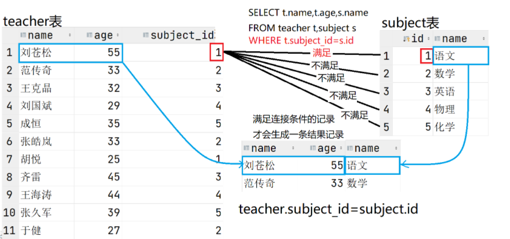
  
- 不指定連接條件，會產生**笛卡爾積**

  ```sql
  SELECT t.name,t.age,s.name
  FROM teacher t,subject s;
  ```

  **笛卡爾積的產生**

  **當不指定連接條件時，數據庫在進行關聯查詢時，仍然會用A表一條記錄與B表每條記錄連接一次，並產生結果集中的一條記錄；此時的數據量爲A表記錄數與B表記錄數的乘積。**

  **當表中數據量大時，這樣的結果集開銷巨大，甚至可能導致服務器宕機，因此要盡量避免。**

  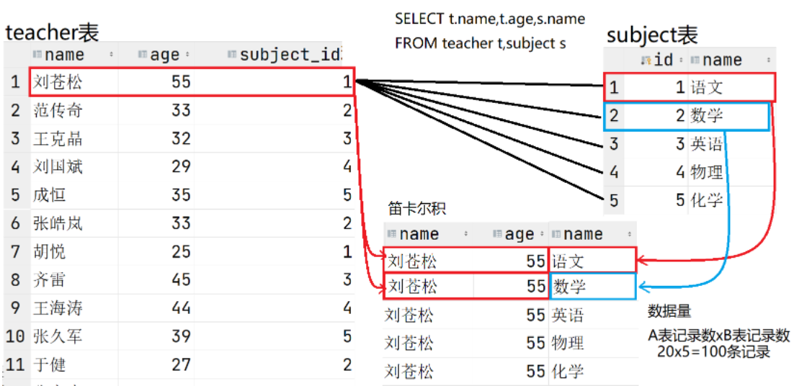

  

- 查看班級的名稱和對應的班主任(老師)是誰?

  ```sql
  1:確定數據來自哪些表，確定FROM子句
    class表和teacher表
    FROM class c,teacher t
  2:當表明確了，就要確定連接條件
    班級表中teacher_id的值記錄了班主任的id應當對應teacher表的老師id
    c.teacher_id=t.id
    
    SELECT c.name,t.name
    FROM class c,teacher t
    WHERE c.teacher_id=t.id;
  ```
  
- 查看每個學生的名字，年齡，以及其所在的班級名稱和所在樓層

  ```sql
  1:確定數據來自哪些表
    class表和student表
    FROM class c,student s
  2:連接條件確定兩張表中記錄的對應關係
    c.id=s.class_id
    
    SELECT s.name,s.age,c.name,c.floor
    FROM class c,student s
    WHERE c.id=s.class_id;
  ```
  


- 王克晶是哪個班的班主任?列出:班級名稱，樓層，老師名稱，工資

  ```sql
  1:數據來自哪些表
    class c,teacher t
  
  2:連接條件
    c.teacher_id=t.id
    
  3:過濾條件
    老師的名字是王克晶
    
    
    SELECT c.name,c.floor,t.name,t.salary
    FROM class c,teacher t
    WHERE c.teacher_id=t.id
    AND t.name='王克晶';     
  ```
  
- 查看三年級的班級班主任都是誰?要列出班級名稱，所在樓層，班主任名字和工資

- 查看來自南京的學生都有誰?要列出城市名字，學生名字，年齡，性別

- 查看5年級的中隊長都有誰?要列出學生名字，年齡，性別，職位和所在班級的名字以及樓層


### 5.4 N張表關聯

N張表關聯查詢，至少要有N-1個連接條件

#### A）示例

- 查看"範傳奇"所帶班級的學生都有誰?要列出:學生名字，年齡，班級名稱，老師名字

  ```sql
  1:數據來自哪些表
    student s,class c,teacher t
    
  2:連接條件
    3張表關聯至少要有2個連接條件
    班級表與學生表的關係:c.id=s.class_id
    班級表與老師表的關係:c.teacher_id=t.id
    
  3:過濾條件  
    老師的名字"範傳奇"
    
    SELECT s.name,s.age,c.name,t.name
    FROM student s,class c,teacher t
    WHERE s.class_id=c.id
    AND c.teacher_id=t.id
    AND t.name='範傳奇';
  ```

  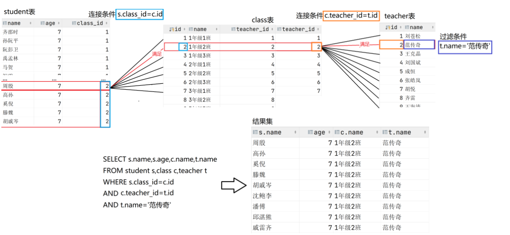

  

- 查看1年級1班的同學的名字和來自的城市

  ```sql
  SELECT s.name,l.name,c.name
  FROM class c,student s,location l
  WHERE c.id=s.class_id
  AND s.location_id=l.id
  AND c.name='1年級1班';
  ```

  

#### B）綜合練習

1. 查看來自北京的學生都是誰?
2. 教"英語"的老師都是誰?
3. 劉蒼松所帶班級的學生都有誰?
4. 教語文的老師所帶的班級有哪些?
5. 王克晶所帶的班級學生都來自哪些城市(去重)?
6. 3年級的幾個班主任都教哪些課程?
7. 工資高於10000的老師所帶班裏的大隊長都是誰?
8. "李費水"的班主任教哪門課?
9. 所在4樓的班裏的大隊長和中隊長以及班主任都是誰?
10. 全校最小的同學的班主任是誰?


### 5.5 關聯查詢與聚合函數

將關聯查詢的結果集進行統計

#### A）示例

- 查看範傳奇所帶班級的學生共多少人?

  ```sql
  1:查詢出參與統計的記錄
    範傳奇所帶班級的所有學生信息
    1.1 數據來自哪些表?
        FROM teacher t,class c,student s
    1.2 連接條件?
        t.id=c.teacher_id
        s.class_id=c.id
    1.3 過濾條件?
        t.name='範傳奇'
        
        SELECT s.name
        FROM teacher t,class c,student s
        WHERE t.id=c.teacher_id
        AND s.class_id=c.id
        AND t.name='範傳奇';
  
  2:在上述查詢出參與統計記錄的DQL中添加聚合函數
    SELECT COUNT(*)
    FROM teacher t,class c,student s
    WHERE t.id=c.teacher_id
    AND s.class_id=c.id
    AND t.name='範傳奇';
  ```
  
- 查看教語文的老師平均工資是多少?

  ```sql
  1:查詢出參與統計的記錄
    查詢教語文的老師工資是多少?
    1.1:數據來自哪些表?
        FROM subject su,teacher t
    1.2:連接條件?
        t.subject_id=su.id
    1.3:過濾條件?
        su.name='語文'
        
    SELECT t.salary
    FROM subject su,teacher t
    WHERE t.subject_id=su.id
    AND su.name='語文';
  
  2:在上述DQL中添加聚合函數
    SELECT AVG(t.salary)
    FROM subject su,teacher t
    WHERE t.subject_id=su.id
    AND su.name='語文';
  ```

- 查看教每門課老師的平均工資是多少(GROUP BY)?列出平均工資和科目名稱

  ```sql
  1:查詢出參與統計的記錄
    查詢出所有老師的工資，所帶科目
    1.1:數據來自哪些表?
        FROM teacher t,subject su
    1.2:連接條件?
        t.subject_id=su.id
    
        SELECT t.name,t.salary,su.name
        FROM teacher t,subject su
        WHERE t.subject_id=su.id;
  
  2:添加分組與聚合函數
    SELECT AVG(t.salary),su.name
    FROM teacher t,subject su
    WHERE t.subject_id=su.id
    GROUP BY su.name;
  ```

- 僅查看平均工資高於6000的那些科目的老師平均工資是多少?列出平均工資和科目名稱

  ```sql
  SELECT AVG(t.salary),su.name
  FROM teacher t,subject su
  WHERE t.subject_id=su.id
  GROUP BY su.name
  HAVING AVG(salary)>6000;
  ```

- 查看工資最高的老師班裏的學生共多少人?

  ```sql
  1:未知條件?  最高工資是多少  確定子查詢
    SELECT MAX(salary) FROM teacher
  
  2:查詢參與統計的記錄
    查詢最高工資老師所帶班的學生都有誰
    2.1:數據來自哪些表
        FROM teacher t,class c,student s
    2.2:連接條件
        t.id=c.teacher_id
        s.class_id=c.id
    2.3:過濾條件:該老師的工資等於最高工資
        t.salary=(SELECT MAX(salary) FROM teacher)
        
        SELECT t.salary,t.name,c.name,s.name
        FROM teacher t,class c,student s
        WHERE t.id=c.teacher_id
        AND s.class_id=c.id
        AND t.salary=(SELECT MAX(salary) FROM teacher);
  
  3:在上述DQL上加聚合函數
    SELECT COUNT(*)
    FROM teacher t,class c,student s
    WHERE t.id=c.teacher_id
    AND s.class_id=c.id
    AND t.salary=(SELECT MAX(salary) FROM teacher);
  ```


#### B）綜合練習

1. 教語文的老師所帶班級各多少學生?
2. 每門課的老師所帶班級各多少學生?
3. 來自上海的學生的班主任都有誰?
4. 來自南京的學生共多少人
5. 來自武漢的男同學和女同學分別多少人?
6. 每個城市的學生各多少人
7. 高於平均工資的老師所帶的班級分別多少學生?
8. 每個老師班裏各多少來自鄭州的學生?


### 5.6 多對多關係

多對多關係：A表與B表雙向看待都是一對多，就是多對多關係

多對多關係需要提供一張關聯關係表來維繫多對多關係。該表保存着兩張產生關係表的外鍵字段.

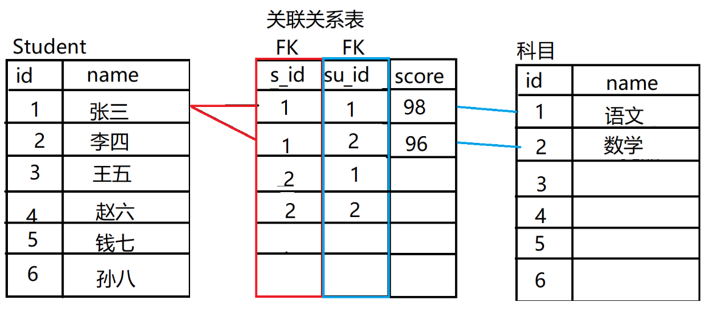

#### A）多對多關聯查詢

**示例**

- 查看學習語文的學生都有誰，列出學生姓名、科目名稱、學生成績?

  ```sql
  SELECT s.name,su.name,tss.score
  FROM subject su,student s,t_stu_subject_score tss
  WHERE su.id=tss.subject_id
  AND s.id=tss.stu_id
  AND su.name='語文';
  ```

  

- 查看'李費水'都學了哪門課程以及成績，列出學生姓名、科目名稱、學生成績?

  ```sql
  SELECT s.name,su.name,tss.score
  FROM student s,subject su,t_stu_subject_score tss
  WHERE su.id=tss.subject_id
  AND s.id=tss.stu_id
  AND s.name='李費水';
  ```
  

#### B）練習

1. 查看1年級1班所有同學的語文成績是多少?
2. 統計1年級1班數學成績的平均值?
3. 統計6年級的英語成績的平均值?
4. 查看"劉蒼松"所帶班級的英語平均分?
5. 查看工資最高的老師所帶班級的各科成績的平均分，最高分和最低分分別是多少?
6. 查看每位大隊長的5門成績平均分是多少？


## 6 連接查詢

### 6.1 內連接

內連接是關聯查詢的另一種寫法；

內連接查詢只會查找到符合條件的記錄，結果和表關聯查詢是一樣的。

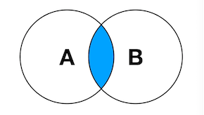

**語法**

```sql
SELECT 子句
FROM 表A
JOIN 表B ON A與B的連接條件
[JOIN 表C ON A與C或B與C的連接條件
 ...
]
WHERE 過濾條件
```

**示例**

- 查看1年級1班的學生信息?列出學生名字,年齡,所在班級

  ```sql
  SELECT s.name,s.age,c.name
  FROM class c,student s
  WHERE c.id=s.class_id		# 連接條件
  AND c.name='1年級1班';		  # 過濾條件
  
  內連接寫法
  SELECT s.name,s.age,c.name
  FROM class c
  JOIN student s ON c.id=s.class_id		# ON子句中書寫連接條件
  WHERE c.name='1年級1班';				  # WHERE子句中寫過濾條件
  ```

- 查看教英語的老師都有誰?

  ```sql
  SELECT t.name,su.name
  FROM teacher t,subject su
  WHERE t.subject_id=su.id
  AND su.name='英語';
  
  內連接寫法
  SELECT t.name,su.name
  FROM teacher t
  JOIN subject su ON t.subject_id=su.id
  WHERE su.name='英語';
  ```
  
- 查看每個班級名以及對應的班主任名字?

  ```sql
  SELECT c.name,t.name
  FROM teacher t
  JOIN class c ON t.id=c.teacher_id;
  ```

- 查看王克晶所帶班級的女同學都有誰?(列出:老師名字，班級名字，學生名字，學生性別)

  ```sql
  SELECT t.name,c.name,s.name,s.gender
  FROM teacher t
  JOIN class c ON t.id=c.teacher_id
  JOIN student s ON c.id=s.class_id
  WHERE t.name='王克晶'
  AND s.gender='女';
  ```

### 6.2 外連接

外連接也用於關聯查詢，**特點:可以將不滿足連接條件的記錄也查詢出來**

- 左外連接：

  以JOIN左側表爲驅動表，該表中所有記錄都要體現在結果集中，右側表不滿足連接條件的記錄對應的字段全部爲NULL。

  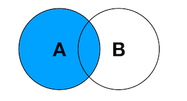

- 右外連接

  以JOIN右側表作爲驅動表，該表中的記錄都要體現在結果集中，左側表不滿足連接條件的字段都補NULL
  
  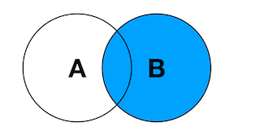

**示例**

- 查看所有班級信息和對應的班主任信息，如果該班沒有班主任也要將班級信息列出來.

  ```sql
  SELECT c.name,t.name
  FROM class c
  JOIN teacher t ON c.teacher_id=t.id;
  
  因爲class表中有三個班級的teacher_id爲99,而teacher表中沒有id爲99的記錄.因此這三條班級記錄由於不滿足連接條件,所以在結果集中沒有被查詢出來.
  
  需求是要將class表中記錄完整展現(不滿足連接條件的記錄也要展現)
  SELECT c.name,c.floor,t.name,t.salary
  FROM class c LEFT JOIN teacher t ON c.teacher_id=t.id;
  ```

  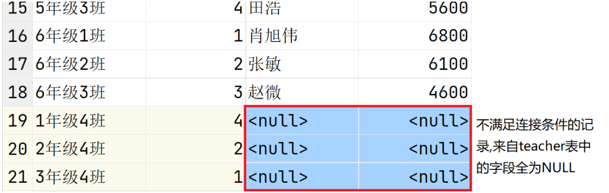

  

- 查看所有班級信息和對應的班主任信息，如果該老師不帶班,也要將老師信息列出來

  ```sql
  SELECT c.name,c.floor,t.name,t.salary
  FROM class c RIGHT JOIN teacher t ON c.teacher_id=t.id;
  ```

  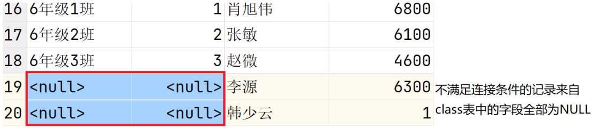


### 6.3 自連接

自連接是指當前表中的一條記錄可以對應自己的多條記錄；

具有相同屬性的一組數據之間又存在上下級的樹狀結構數據。

例如:

- 一個公司的人員組織結構。大家都是員工，員工又存在上下級。

- 電商中常見的分類樹

  

**示例**

- 查看'劉蒼松'的下屬都有誰?

  ```sql
  teacher表中記錄了所有老師的信息,而manager字段記錄了該老師的上級老師的id
  manager字段記錄了teacher表主鍵字段id的值.
  
  SELECT t.name,m.name
  FROM teacher t,teacher m     # 將teacher當做兩張表看待,t表示保存老師  m表示保存領導
  WHERE t.manager=m.id
  AND m.name='劉蒼松';
  
  內連接寫法
  SELECT t.name,m.name
  FROM teacher t
  JOIN teacher m ON t.manager=m.id
  WHERE m.name='劉蒼松';
  
  ```

- 查看3年級2班的班長是誰?(student表中team_leader記錄班長的學生id)

  ```sql
  班長的特點:teacher_leader的值與id值相同的學生應當就是該班的班長
  
  SELECT s.name
  FROM class c
  JOIN student s ON s.class_id=c.id
  WHERE c.name='3年級2班'
  AND s.team_leader=s.id;
  ```


# JDBC

JDBC（Java Database Connectivity）是Java官方提供的一套API，用於連接各種數據庫。它提供了一組用於執行SQL語句的Java方法，以及連接到數據源和處理查詢結果的一些工具和類。

## 1 JDBC核心接口

* Connection

  表示數據庫的連接

* Statement

  用來執行SQL語句的語句對象

* PreparedStatement

  用來執行預編譯SQL語句的語句對象

* ResultSet

  用來表示查詢結果集

不同的DBMS都會提供一套具體的實現類，並打包爲jar，這個jar包被稱爲連接該DBMS的驅動（Driver）。


## 2 JDBC使用流程

### 2.1 pom.xml中添加依賴

Maven倉庫地址：https://mvnrepository.com/

達內下載地址：http://doc.vrd.net.cn/

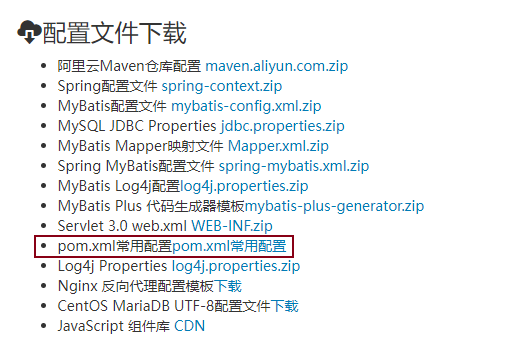

pom.xml中添加MySQL數據庫依賴，並刷新maven

```xml
<dependencies>
    <!-- 連接MySQL數據庫的依賴 -->
    <dependency>
        <groupId>mysql</groupId>
        <artifactId>mysql-connector-java</artifactId>
        <version>8.0.15</version>
    </dependency>
</dependencies>
```


### 2.2 加載JDBC驅動程序

在使用JDBC前，必須先加載所需的JDBC驅動程序。

```java
Class.forName("com.mysql.jdbc.Driver");
```


### 2.3 建立數據庫連接

要連接到數據庫，必須使用JDBC中的DriverManager類。

DriverManager類負責管理JDBC驅動程序，它使用特定的URL和屬性來獲取連接。示例代碼如下：

```java
String url = "jdbc:mysql://localhost:3306/tedu?characterEncoding=utf8&useSSL=false&serverTimezone=Asia/Shanghai&rewriteBatchedStatements=true";
String user = "root";
String password = "root";
Connection connection = DriverManager.getConnection(url, user, password);
```


### 2.4 執行SQL語句

* Statement對象執行SQL

  執行SQL語句的最常用方法是使用Statement對象。Statement對象用於執行靜態SQL語句。例如：

  ```java
  Statement statement = connection.createStatement();
  String sql = "SELECT * FROM student";
  ResultSet resultSet = statement.executeQuery(sql);
  ```


* PreparedStatement對象執行SQL

  PreparedStatement對象用於執行動態SQL語句。例如：

  ```mysql
  String sql = "UPDATE student SET name = ? WHERE id = ?";
  PreparedStatement statement = connection.prepareStatement(sql);
  statement.setString(1, "Tom");
  statement.setInt(2, 1);
  statement.executeUpdate();
  ```


### 2.5 處理查詢結果

JDBC API提供了ResultSet對象，用於處理查詢結果。可以使用ResultSet對象的getXXX方法獲取查詢結果中的數據。例如：

```java
while (resultSet.next()) {
    int id = resultSet.getInt("id");
    String name = resultSet.getString("name");
}
```


## 3 JDBC異常處理

在使用JDBC時，可能會發生各種異常。JDBC API定義了SQLException類來處理這些異常。建議在應用程序中使用try-catch語句處理異常。例如：

```java
try {
    // JDBC代碼
} catch (SQLException e) {
    // 處理異常
}
```


## 4 數據庫連接池

### 4.1 簡介

阿里巴巴數據庫連接池（Druid）是阿里巴巴開源的一個基於 JDBC 數據庫連接池。

### 4.2 Maven依賴

```xml
<!-- 數據庫連接池 -->
<dependency>
    <groupId>com.alibaba</groupId>
    <artifactId>druid</artifactId>
    <version>1.1.21</version>
</dependency>
```

### 4.3 優點

* 提高性能

  數據庫連接池中可以預先創建一定數量的連接並一直保持打開狀態，避免了每次請求都需要建立連接和關閉連接的開銷，從而提高了系統性能。

* 節省資源

  數據庫連接池通過避免每次請求都創建和關閉連接降低了系統中數據庫連接的數量，節省了系統資源，提高了系統的可擴展性。

* 避免了連接泄露

  數據庫連接池在使用完畢後會歸還連接到連接池中，避免了長時間佔用連接的情況，減少了連接泄漏的機會。

### 4.4 使用流程

1. 添加依賴 **pom.xml** ，並刷新maven

   ```xml
   <!-- 數據庫連接池 -->
   <dependency>
       <groupId>com.alibaba</groupId>
       <artifactId>druid</artifactId>
       <version>1.1.21</version>
   </dependency>
   ```

2. 初始化連接池，指定最大連接數和初始連接數 **DBUtil**

   ```java
   package jdbc;
   
   import com.alibaba.druid.pool.DruidDataSource;
   
   import java.sql.Connection;
   import java.sql.DriverManager;
   import java.sql.SQLException;
   import java.sql.Statement;
   
   public class DBUtil {
       // 連接池
       private static DruidDataSource ds;
   
       static {
           initDataSource(); // 初始化連接池
       }
   
       private static void initDataSource(){
           ds = new DruidDataSource();
           ds.setUsername("root");
           ds.setPassword("root");
           ds.setUrl("jdbc:mysql://localhost:3306/tedu?characterEncoding=utf8&useSSL=false&serverTimezone=Asia/Shanghai&rewriteBatchedStatements=true");
           ds.setMaxActive(30); // 最大連接數
           ds.setInitialSize(5); // 初始連接數
       }
   
       public static Connection getConnection() throws SQLException {
           return ds.getConnection();
       }
   }
   ```


